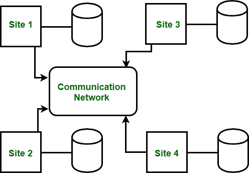

# 分布式数据库系统的十二条日期规则

> 原文:[https://www . geesforgeks . org/date-十二规则分布式数据库系统/](https://www.geeksforgeeks.org/dates-twelve-rules-for-distributed-database-systems/)

[分布式数据库](https://www.geeksforgeeks.org/concepts-of-distributed-databases/)带来了由大量处理元素组成的分布式计算的优势，元素可能是异构的。元件与帮助执行指定任务的网络相连。基本上，它用于通过将问题分配到多个较小的问题中来解决问题，并以协调的方式解决较小的问题。

分布式数据库管理系统是一个单一的逻辑数据库，它在物理上分布在通过各种数据通信链路连接的多台计算机上。它可以定义为由不同部分的数据集合组成的数据库，由运行在独立计算机上并通过数据通信链路连接的独立数据库控制。
这是一种虚拟数据库，因为在这种情况下，组件物理存储在多个不同位置的多个不同数据库中。在这个数据库中，分发和交易都是透明的。我们所说的透明分发是指，如果数据存储在自己的位置，用户可以通过网络访问任何地方的数据。我们所说的透明事务是指，事务被分成子事务时必须在多个数据库下保持数据库的完整性。有助于建立分布式数据库并提供对用户透明的访问的软件称为分布式数据库管理系统。

**分布式数据库系统的 DATE 十二规则:**
不讨论 Date 十二规则，关于 DDBMS 的讨论就不完整。遵循该规则的数据库管理系统是纯粹的分布式数据库管理系统。

规则如下:

1.  **本地自治或本地站点独立–**
    每个站点都有自己的操作，也充当独立自主的集中式数据库管理系统。对于安全性、并发控制、备份和恢复，每个站点都有责任..

2.  **中心站点独立性–**
    所有站点都是平等的，没有一个站点依赖于中心站点来执行任何服务。我们可以说没有哪个系统不能运行的站点。有些服务不需要中央服务器，它们是事务管理、查询优化、死锁检测和全局系统目录管理。

3.  **连续运行–**
    现场故障对系统没有影响。即使在站点故障或网络扩展的情况下，系统也能继续运行。

4.  **本地独立–**
    要检索系统中的任何数据，需要了解数据的存储，即数据在系统中的存储位置。

5.  **碎片独立性–**
    用户只能看到一个逻辑数据库。数据碎片对用户是透明的。要检索数据库的任何片段，不需要知道数据库片段的名称。

6.  **复制独立性–**
    数据可以在不同的站点进行复制和存储。分布式数据库管理系统对用户透明地管理所有的片段。

7.  **分布式查询独立性–**
    在不同位置执行单个查询，不能满足透明请求。因此，查询优化至关重要，并且由分布式数据库管理系统透明地执行。

8.  **分布式事务独立性–**
    事务能够透明地更新不同站点的数据，但是恢复和并发的控制是通过使用代理来实现的。
9.  **硬件独立性–**
    DDBMS 应该可以在不同的硬件平台上运行。

10.  **操作系统独立性–**
    DDBMS 应该可以在不同的操作系统平台上运行。

11.  **Network Independence –** 
    The DDBMS system is able to run on any network platform. 
12.  **数据库独立性–**
    系统必须支持数据库产品的任何供应商。