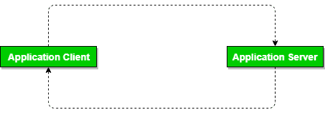
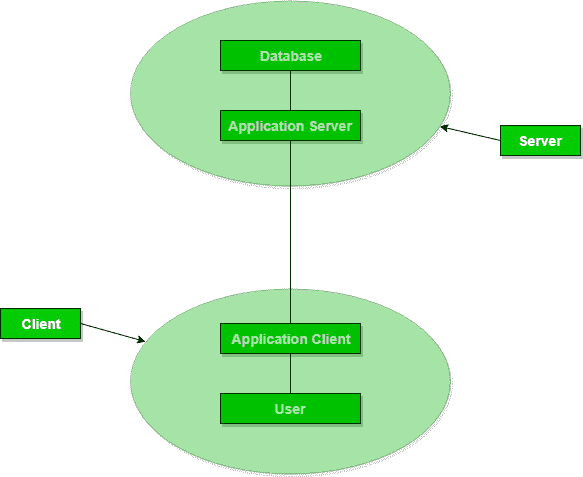

# DBMS 架构二级、三级

> 原文:[https://www . geesforgeks . org/DBMS-architecture-2-level-3-level/](https://www.geeksforgeeks.org/dbms-architecture-2-level-3-level/)

**两层架构:**
两层架构类似于基本的**客户端-服务器**模型。客户端的应用程序直接与服务器端的数据库通信。像 ODBC、JDBC 这样的 API 被用于这种交互。服务器端负责提供查询处理和事务管理功能。在客户端，运行用户界面和应用程序。客户端的应用程序与服务器端建立连接，以便与数据库管理系统通信。
这种类型的优点是维护和理解更容易，与现有系统兼容。然而，当有大量用户时，这种模型的性能很差。

**三层架构:**
在这种类型中，客户端和服务器之间还有另一层。客户端不直接与服务器通信。相反，它与应用服务器交互，应用服务器进一步与数据库系统通信，然后进行查询处理和事务管理。这个中间层充当服务器和客户端之间交换部分处理数据的媒介。这种类型的架构用于大型 web 应用程序。
**优势:**

*   **由于应用服务器的分布式部署，增强了可扩展性**。现在，不需要在客户机和服务器之间建立单独的连接。
*   **保持数据完整性**。由于客户端和服务器之间有一个中间层，因此可以避免/消除数据损坏。
*   **安全性**提高。这种类型的模型阻止了客户端与服务器的直接交互，从而减少了对未授权数据的访问。

**缺点** :
实施和沟通的复杂性增加。由于中间层的存在，这种交互变得很难发生。

**三层架构**

本文由 Avneet Kaur 供稿。如果你发现任何不正确的地方，或者你想分享更多关于上面讨论的话题的信息，请写评论。