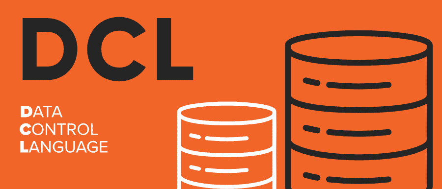

# DCL 完整格式

> 原文:[https://www.geeksforgeeks.org/dcl-full-form/](https://www.geeksforgeeks.org/dcl-full-form/)

**DCL** 在结构化查询语言(SQL)中代表**数据控制语言**。顾名思义，这些命令用于控制数据库中的权限。执行所有数据库操作(如创建表、视图或序列)都需要特权(访问数据的权利)。
DCL 命令是一种语句，用于执行与数据库系统的权限、权限和其他控制相关的工作。



数据库中有两种类型的**权限**:

*   **系统特权**
*   **对象权限**

#### 需要 DCL 命令

*   应该防止对数据的未授权访问，以实现我们数据库的安全性
*   DCL 命令比数据库管理员以外的任何人都更有效地维护数据库，未经许可，不允许访问数据。
*   这些命令为数据管理员提供了以精细方式设置和删除数据库权限的灵活性。

#### DCL 中的命令

两个最重要的 **DCL 命令**是:

*   **格兰特**
*   **撤销**

#### 同意

此命令用于授予用户对特定对象执行特定操作的权限。如果您是数据库管理员，并且希望限制用户的可访问性，例如只查看数据或只更新数据的用户。您可以根据自己的意愿将权限授予用户。

**语法:**

```
GRANT privilege_list
ON Object_name
TO user_name;

```

#### 取消

此命令用于收回用户的权限/访问权。如果您想从数据库中返回您当时授予用户的权限，您需要运行 REVOKE 命令。

**语法:**

```
REVOKE privilege_list
ON object_name
FROM user_name;

```

以下命令作为特权列表授予用户:

*   执行
*   更新
*   挑选
*   删除
*   改变
*   全部

#### DCL 命令的优点

*   它允许限制用户访问数据库中的数据。
*   当数据暴露给多个用户时，它确保了数据库的安全性。
*   数据所有者或数据管理员有责任维护授予和撤销用户权限的权力，以防止对数据的任何威胁。
*   它防止没有数据库访问权限的其他用户对数据库进行更改