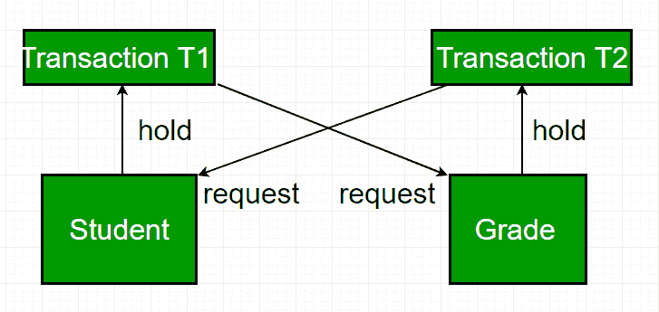
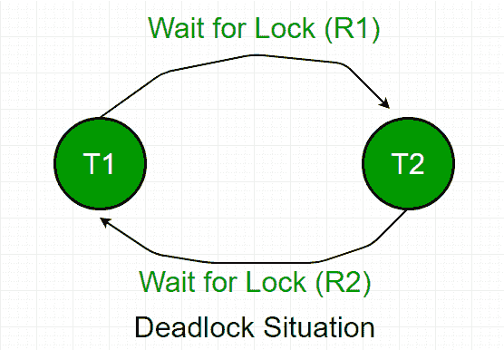

# 数据库管理系统中的死锁

> 原文:[https://www.geeksforgeeks.org/deadlock-in-dbms/](https://www.geeksforgeeks.org/deadlock-in-dbms/)

在数据库中，死锁是一种不希望出现的情况，即两个或多个事务无限期地等待对方放弃锁。据说死锁是数据库管理系统中最令人害怕的复杂问题之一，因为它会使整个系统停止运行。

**示例–**我们用一个例子来理解死锁的概念:
假设事务 T1 持有学生表中某些行的锁，**需要更新**成绩表中的某些行。同时，事务 **T2 在成绩表**中持有**锁，但需要**更新事务 T1 持有的学生表**中的行。**

现在，主要问题出现了。事务 T1 将等待事务 T2 放弃锁，同样，事务 T2 将等待事务 T1 放弃锁。因此，除非数据库管理系统检测到死锁并中止其中一个事务，否则所有活动都将停止并永远处于停滞状态。

数据库管理系统中的死锁

**避免死锁–**
当数据库陷入死锁时，避免死锁总是比重新启动或中止数据库更好。死锁避免方法适用于较小的数据库，而死锁预防方法适用于较大的数据库。
避免死锁的一种方法是使用应用程序一致的逻辑。在上面给出的示例中，访问学生和成绩的事务应该总是以相同的顺序访问表。这样，在上述场景中，事务 T1 只需等待事务 T2 在开始之前释放等级锁。当事务 T2 释放锁时，事务 T1 可以自由进行。
避免死锁的另一种方法是同时应用行级锁定机制和 READ COMMITTED 隔离级别。但是，它不能保证完全消除死锁。

**死锁检测–**
当事务无限期等待获取锁时，数据库管理系统应该检测事务是否涉及死锁。

**等待图**是检测死锁情况的方法之一。这种方法适用于较小的数据库。在这种方法中，基于事务和它们对资源的锁定来绘制图形。如果创建的图形有一个闭环或循环，则存在死锁。
对于上述场景，等待图绘制如下

**死锁预防–**
对于大型数据库，死锁预防方法是合适的。如果资源的分配方式使得死锁永远不会发生，则可以防止死锁。数据库管理系统分析这些操作是否会造成死锁情况，如果会，则永远不允许执行该事务。

死锁预防机制提出了两种方案:

*   **Wait-Die Scheme –** 
    In this scheme, If a transaction requests a resource that is locked by another transaction, then the DBMS simply checks the timestamp of both transactions and allows the older transaction to wait until the resource is available for execution. 
    Suppose, there are two transactions T1 and T2, and Let the timestamp of any transaction T be TS (T). Now, If there is a lock on T2 by some other transaction and T1 is requesting for resources held by T2, then DBMS performs the following actions: 

    检查 TS (T1) < TS (T2) – if T1 is the older transaction and T2 has held some resource, then it allows T1 to wait until resource is available for execution. That means if a younger transaction has locked some resource and an older transaction is waiting for it, then an older transaction is allowed to wait for it till it is available. If T1 is an older transaction and has held some resource with it and if T2 is waiting for it, then T2 is killed and restarted later with random delay but with the same timestamp. i.e. if the older transaction has held some resource and the younger transaction waits for the resource, then the younger transaction is killed and restarted with a very minute delay with the same timestamp. 
    该方案是否允许较旧的事务等待，但杀死较年轻的事务。

*   **Wound Wait Scheme –** 
    In this scheme, if an older transaction requests for a resource held by a younger transaction, then an older transaction forces a younger transaction to kill the transaction and release the resource. The younger transaction is restarted with a minute delay but with the same timestamp. If the younger transaction is requesting a resource that is held by an older one, then the younger transaction is asked to wait till the older one releases it. 

**参考文献–**
[甲骨文](https://docs.oracle.com/javadb/10.8.3.0/devguide/derbydev.pdf)
[等待-死亡和创伤-等待](https://stackoverflow.com/questions/32794142/what-is-the-difference-between-wait-die-and-wound-wait)
的区别本书–[纳瓦斯数据库系统基础](https://amzn.to/2TjTV7l)