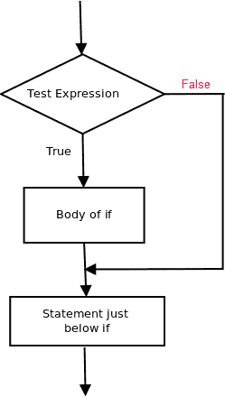
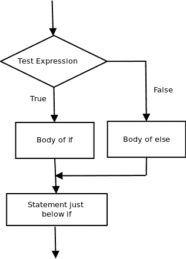

# PL/SQL 中的决策(如果-那么，如果-那么-否则，嵌套如果-那么，如果-那么-否则-那么)

> 原文:[https://www . geesforgeks . org/decision-pl SQL-else-nested-elsif-else/](https://www.geeksforgeeks.org/decision-making-plsql-else-nested-elsif-else/)

在现实生活中，有些情况下我们需要做出一些决定，根据这些决定，我们决定下一步该做什么。类似的情况也会出现在编程中，我们需要做出一些决定，并根据这些决定执行下一个代码块。

编程语言中的决策语句决定了程序执行的流向。pl/SQL 中可用的决策语句有:

1.  if then 语句
2.  如果是，那么陈述
3.  嵌套 if-then 语句
4.  如果-那么-否则-那么-否则梯子

2.  **if then 语句
    if then 语句是最简单的决策语句。它用于决定是否执行某个语句或语句块，即如果某个条件为真，则执行某个语句块，否则不执行。**

**语法:**

```
if condition then
-- do something
end if; 
```

**这里，评估后的条件不是真就是假。如果语句接受布尔值——如果值为真，则它将执行其下的语句块，否则不执行。
if 和 endif 在这里视为一个块。**

**示例:-**

## **结构化查询语言**

```
declare
-- declare the values here

begin

if condition then
dbms_output.put_line('output');

end if;

dbms_output.put_line('output2');
end;
```

****

## **结构化查询语言**

```
-- pl/sql program to illustrate If statement
declare
num1 number:= 10;
num2 number:= 20;

begin

if num1 > num2 then
dbms_output.put_line('num1 small');
end if;

dbms_output.put_line('I am Not in if');

end;
```

**因为 if 语句中的条件为假。所以，if 语句下面的块没有被执行。
输出:**

```
I am Not in if 
```

*   ****if – then- else:
    The if statement alone tells us that if a condition is true it will execute a block of statements and if the condition is false it won’t. But what if we want to do something else if the condition is false. Here comes the else statement. We can use the else statement with if statement to execute a block of code when the condition is false.
    Syntax:-

    ```
    if (condition) then
        -- Executes this block if
        -- condition is true
    else 
        -- Executes this block if
        -- condition is false

    ```

    

    示例:-

    ## 结构化查询语言

    ```
    -- pl/sql program to illustrate If else statement
    declare
    num1 number:= 10;
    num2 number:= 20;

    begin

    if num1 < num2 then
    dbms_output.put_line('i am in if block');

    ELSE
    dbms_output.put_line('i am in else Block');
    end if;

    dbms_output.put_line('i am not in if or else Block');
    end;
    ```

    输出:-

    ```
    i'm in if Block
    i'm not in if and not in else Block

    ```

    else 语句后面的代码块在调用不在块中(没有空格)的语句后，作为 if 语句中的条件 false 执行。**** *   ******nested-if-then:
    A nested if-then is an if statement that is the target of another if statement. Nested if-then statements mean an if statement inside another if statement. Yes, PL/SQL allows us to nest if statements within if-then statements. i.e, we can place an if then statement inside another if then statement.

    语法:-

    ```
    if (condition1) then
       -- Executes when condition1 is true
       if (condition2) then 
         -- Executes when condition2 is true
       end if; 
    end if;

    ```

    

    ## 结构化查询语言

    ```
    -- pl/sql program to illustrate nested If statement
    declare
    num1 number:= 10;
    num2 number:= 20;
    num3 number:= 20;

    begin
    if num1 < num2 then
    dbms_output.put_line('num1 small num2');

      if num1 < num3 then  
      dbms_output.put_line('num1 small num3 also');
      end if;

    end if;

    dbms_output.put_line('after end if');
    end;
    ```******