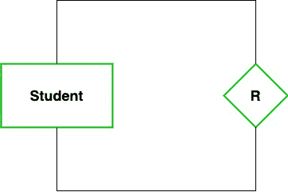
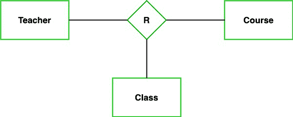
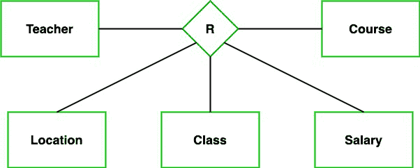

# 关系在数据库管理系统中的程度

> 原文:[https://www.geeksforgeeks.org/degree-of-relations-in-dbms/](https://www.geeksforgeeks.org/degree-of-relations-in-dbms/)

我们生活在一个世界里，在这个世界里，无论是有生命的还是无生命的，每一个实体都彼此有关系。例如，你是一个单一的实体，但是你和你的家人、朋友有着不同的关系。即使在一个类似家庭的家庭中，你也是你父亲的儿子，同时你也是你兄弟的兄弟姐妹。类似地，关系也存在于数据库管理系统中。在这篇文章中，我们将学习什么是关系的程度，以及关系的类型。

### 关系程度

在数据库管理系统中，关系的程度表示关系中关联的实体类型的数量。例如，我们有两个实体，一个是学生，另一个是包，它们与主键和外键相连。因此，在这里我们可以看到，关系的程度是 2，因为两个实体在一个关系中关联。

**度数类型**

现在，根据链接实体类型的数量，我们有 4 种类型的关系度。

1.  一元的
2.  二进制的
3.  第三的
4.  N 和-

让我们借助例子逐一讨论。

### 一元的

在这种类型的关系中，关联的实体类型是相同的。因此，我们可以说，当两种实体类型相同时，一元关系存在，我们称之为关系度为 1。或者换句话说，在一个关系中只有一个实体集参与，那么这种类型的关系称为一元关系。

**例:**在一个特定的班级，我们有很多学生，也有班长。所以，这里的班长也是学生。因此，我们可以说只有学生在这里参与。所以这种关系的程度是 1。

### 二进制(二级)

在二元关系中，有两种类型的实体关联。因此，我们可以说，当存在两种类型的实体时，二元关系存在，我们称它们为关系度为 2。或者换句话说，在两个实体集参与的关系中，这种类型的关系称为二元关系。这是最常用的关系，可以很容易地转换成关系表。

**示例:**我们有两种实体类型“学生”和“身份证”，其中每个“学生”都有自己的“身份证”。所以，这里两种实体类型是关联的，我们可以说它是二元关系。此外，一个“学生”可以有多个“女儿”，但每个“女儿”只能属于一个“父亲”。我们可以说是一对多的二元关系。

### 三元(三级)

在三元关系中，有三种类型的实体关联。所以，当存在三种类型的实体时，我们可以说三元关系存在，我们称它们为关系度为 3。由于实体数量因此而增加，将 E-R 转换成关系表变得非常复杂。现在让我们通过例子来理解。

**示例:**我们有三种实体类型“教师”、“课程”和“班级”。这些实体之间的关系被定义为教师教授特定的课程，也就是教师教授特定的班级。所以，这里三种实体类型是关联的，我们可以说它是三元关系。

### N 度和（n 度）

在 N 元关系中，有 N 种类型的实体关联。因此，我们可以说，当存在 N 种类型的实体时，存在 N 元关系。N 元关系有一个限制，因为有很多实体，所以很难转换成一个实体，即 rational table。所以，这是非常罕见的，不像二进制是非常流行的。

**例:**我们有 5 个实体老师、班级、地点、薪资、课程。这里有五种实体类型关联，我们可以说 n 元关系是 5。

