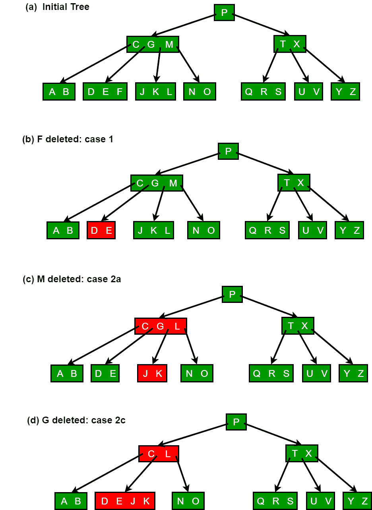
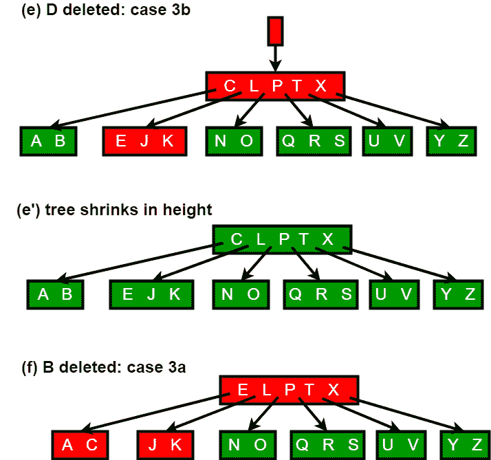

# B- Tree 中的删除操作

> 原文:[https://www.geeksforgeeks.org/delete-operation-in-b-tree/](https://www.geeksforgeeks.org/delete-operation-in-b-tree/)

建议将以下职位作为该职位的先决条件。

[B-Tree |第 1 集(简介)](https://www.geeksforgeeks.org/b-tree-set-1-introduction-2/)
[B-Tree |第 2 集(插入)](https://www.geeksforgeeks.org/b-tree-set-1-insert-2/)

b 树是一种多路搜索树。所以，如果你一般不熟悉多路搜索树，不如先看看[这个来自 IIT-德里](http://www.youtube.com/watch?v=JZhdUb5F7oY)的视频讲座，再进一步。一旦你弄清楚了多路搜索树的基本知识，B 树操作将更容易理解。

以下解释和算法的来源是[Clifford Stein，Thomas H. Cormen，Charles E. Leiserson，罗纳德·L·李维斯特《算法导论》第三版](http://www.flipkart.com/introduction-algorithms-3/p/itmczynzhyhxv2gs?pid=9788120340077&affid=sandeepgfg)

**删除过程:**
从 B 树中删除比插入更复杂，因为我们可以从任何节点中删除一个键——而不仅仅是一个叶子——当我们从内部节点中删除一个键时，我们将不得不重新排列节点的子节点。

和插入一样，我们必须确保删除不会违反 [B 树属性](https://www.geeksforgeeks.org/b-tree-set-1-introduction-2/)。就像我们必须确保一个节点不会因为插入而变得太大一样，我们必须确保一个节点在删除过程中不会变得太小(除了允许根的键少于最小数量 t-1)。正如一个简单的插入算法可能必须备份要插入密钥的路径上的一个节点是否已满一样，一个简单的删除方法可能必须备份要删除密钥的路径上的一个节点(根节点除外)是否具有最少数量的密钥。

删除过程从以 x 为根的子树中删除键 k。该过程保证每当它在节点 x 上递归调用自己时，x 中的键的数量至少是最小度数 t。请注意，该条件比通常的 B 树条件要求的最小值多一个键，因此有时在递归下降到该子节点之前，一个键可能必须移动到该子节点中。这个增强的条件允许我们在一次向下传递中从树中删除一个键，而不必“备份”(有一个例外，我们将解释)。您应该理解以下从 B 树中删除的规范，如果根节点 x 曾经成为没有键的内部节点(这种情况可能发生在情况 2c 和 3b 中，然后我们删除 x，x 的唯一子节点 x.c1 成为树的新根，将树的高度减少一，并保留树的根至少包含一个键的属性(除非树是空的)。

我们简要描述了从 B 树中删除键的各种情况下删除是如何工作的。

**1。**如果密钥 k 在节点 x，x 是叶子，则从 x 中删除密钥 k。

**2。**如果密钥 k 在节点 x 中，x 是内部节点，请执行以下操作。

**a)** 如果节点 x 中 k 前面的子节点 y 至少有 t 个键，那么在以 y 为根的子树中找到 k 的前身 k0，递归删除 k0，用 x 中的 k0 替换 k(我们可以找到 k0，一次向下删除。)

**b)** 如果 y 的键少于 t，那么，对称地，检查节点 x 中跟在 k 后面的子 z，如果 z 至少有 t 个键，那么在以 z 为根的子树中找到 k 的后继 k0，递归删除 k0，用 x 中的 k0 替换 k(我们可以找到 k0，在一次向下传递中删除它。)

**c)** 否则，如果 y 和 z 都只有 t-1 个键，则将 k 和 z 的全部合并为 y，这样 x 就同时丢失了 k 和指向 z 的指针，y 现在包含 2t-1 个键。然后释放 z，从 y 中递归删除 k。

**3。**如果内部节点 x 中不存在密钥 k，则确定必须包含 k 的适当子树的根 x.c(i)，如果 k 在树中的话。如果 x.c(i)只有 t-1 个键，必要时执行步骤 3a 或 3b，以保证我们下降到至少包含 t 个键的节点。然后在 x 的适当子对象上递归结束。

**a)** 如果 x.c(i)只有 t-1 个键，但有一个至少有 t 个键的直接同级，则通过将一个键从 x 向下移动到 x.c(i)，将一个键从 x.c(i)的直接左或右同级向上移动到 x，并将适当的子指针从同级移动到 x.c(i)来给 x.c(i)一个额外的键。

**b)** 如果 x.c(i)和 x.c(i)的两个直接同级都有 t-1 个键，则将 x.c(i)与一个同级合并，这包括将一个键从 x 向下移动到新的合并节点中，成为该节点的中间键。

由于 B 树中的大多数键都在叶子中，因此删除操作最常用于从叶子中删除键。递归删除过程然后向下遍历树，而不必备份。但是，当删除内部节点中的键时，该过程会向下遍历树，但可能必须返回到删除该键的节点，以用它的前一个或后一个替换该键(情况 2a 和 2b)。

下图解释了删除过程。
[](https://media.geeksforgeeks.org/wp-content/uploads/bplustree.png) 
[](https://media.geeksforgeeks.org/wp-content/uploads/bplustr.png)

**实现:**
下面是 C++实现的删除过程。

```
/* The following program performs deletion on a B-Tree. It contains functions
   specific for deletion along with all the other functions provided in the
   previous articles on B-Trees. See https://www.geeksforgeeks.org/b-tree-set-1-introduction-2/
   for previous article.

   The deletion function has been compartmentalized into 8 functions for ease
   of understanding and clarity

   The following functions are exclusive for deletion
   In class BTreeNode:
    1) remove
    2) removeFromLeaf
    3) removeFromNonLeaf
    4) getPred
    5) getSucc
    6) borrowFromPrev
    7) borrowFromNext
    8) merge
    9) findKey

   In class BTree:
     1) remove

  The removal of a key from a B-Tree is a fairly complicated process. The program handles
  all the 6 different cases that might arise while removing a key.

  Testing: The code has been tested using the B-Tree provided in the CLRS book( included
  in the main function ) along with other cases.

  Reference: CLRS3 - Chapter 18 - (499-502)
  It is advised to read the material in CLRS before taking a look at the code. */

#include<iostream>
using namespace std;

// A BTree node
class BTreeNode
{
    int *keys;  // An array of keys
    int t;      // Minimum degree (defines the range for number of keys)
    BTreeNode **C; // An array of child pointers
    int n;     // Current number of keys
    bool leaf; // Is true when node is leaf. Otherwise false

public:

    BTreeNode(int _t, bool _leaf);   // Constructor

    // A function to traverse all nodes in a subtree rooted with this node
    void traverse();

    // A function to search a key in subtree rooted with this node.
    BTreeNode *search(int k);   // returns NULL if k is not present.

    // A function that returns the index of the first key that is greater
    // or equal to k
    int findKey(int k);

    // A utility function to insert a new key in the subtree rooted with
    // this node. The assumption is, the node must be non-full when this
    // function is called
    void insertNonFull(int k);

    // A utility function to split the child y of this node. i is index
    // of y in child array C[].  The Child y must be full when this
    // function is called
    void splitChild(int i, BTreeNode *y);

    // A wrapper function to remove the key k in subtree rooted with
    // this node.
    void remove(int k);

    // A function to remove the key present in idx-th position in
    // this node which is a leaf
    void removeFromLeaf(int idx);

    // A function to remove the key present in idx-th position in
    // this node which is a non-leaf node
    void removeFromNonLeaf(int idx);

    // A function to get the predecessor of the key- where the key
    // is present in the idx-th position in the node
    int getPred(int idx);

    // A function to get the successor of the key- where the key
    // is present in the idx-th position in the node
    int getSucc(int idx);

    // A function to fill up the child node present in the idx-th
    // position in the C[] array if that child has less than t-1 keys
    void fill(int idx);

    // A function to borrow a key from the C[idx-1]-th node and place
    // it in C[idx]th node
    void borrowFromPrev(int idx);

    // A function to borrow a key from the C[idx+1]-th node and place it
    // in C[idx]th node
    void borrowFromNext(int idx);

    // A function to merge idx-th child of the node with (idx+1)th child of
    // the node
    void merge(int idx);

    // Make BTree friend of this so that we can access private members of
    // this class in BTree functions
    friend class BTree;
};

class BTree
{
    BTreeNode *root; // Pointer to root node
    int t;  // Minimum degree
public:

    // Constructor (Initializes tree as empty)
    BTree(int _t)
    {
        root = NULL;
        t = _t;
    }

    void traverse()
    {
        if (root != NULL) root->traverse();
    }

    // function to search a key in this tree
    BTreeNode* search(int k)
    {
        return (root == NULL)? NULL : root->search(k);
    }

    // The main function that inserts a new key in this B-Tree
    void insert(int k);

    // The main function that removes a new key in thie B-Tree
    void remove(int k);

};

BTreeNode::BTreeNode(int t1, bool leaf1)
{
    // Copy the given minimum degree and leaf property
    t = t1;
    leaf = leaf1;

    // Allocate memory for maximum number of possible keys
    // and child pointers
    keys = new int[2*t-1];
    C = new BTreeNode *[2*t];

    // Initialize the number of keys as 0
    n = 0;
}

// A utility function that returns the index of the first key that is
// greater than or equal to k
int BTreeNode::findKey(int k)
{
    int idx=0;
    while (idx<n && keys[idx] < k)
        ++idx;
    return idx;
}

// A function to remove the key k from the sub-tree rooted with this node
void BTreeNode::remove(int k)
{
    int idx = findKey(k);

    // The key to be removed is present in this node
    if (idx < n && keys[idx] == k)
    {

        // If the node is a leaf node - removeFromLeaf is called
        // Otherwise, removeFromNonLeaf function is called
        if (leaf)
            removeFromLeaf(idx);
        else
            removeFromNonLeaf(idx);
    }
    else
    {

        // If this node is a leaf node, then the key is not present in tree
        if (leaf)
        {
            cout << "The key "<< k <<" is does not exist in the tree\n";
            return;
        }

        // The key to be removed is present in the sub-tree rooted with this node
        // The flag indicates whether the key is present in the sub-tree rooted
        // with the last child of this node
        bool flag = ( (idx==n)? true : false );

        // If the child where the key is supposed to exist has less that t keys,
        // we fill that child
        if (C[idx]->n < t)
            fill(idx);

        // If the last child has been merged, it must have merged with the previous
        // child and so we recurse on the (idx-1)th child. Else, we recurse on the
        // (idx)th child which now has atleast t keys
        if (flag && idx > n)
            C[idx-1]->remove(k);
        else
            C[idx]->remove(k);
    }
    return;
}

// A function to remove the idx-th key from this node - which is a leaf node
void BTreeNode::removeFromLeaf (int idx)
{

    // Move all the keys after the idx-th pos one place backward
    for (int i=idx+1; i<n; ++i)
        keys[i-1] = keys[i];

    // Reduce the count of keys
    n--;

    return;
}

// A function to remove the idx-th key from this node - which is a non-leaf node
void BTreeNode::removeFromNonLeaf(int idx)
{

    int k = keys[idx];

    // If the child that precedes k (C[idx]) has atleast t keys,
    // find the predecessor 'pred' of k in the subtree rooted at
    // C[idx]. Replace k by pred. Recursively delete pred
    // in C[idx]
    if (C[idx]->n >= t)
    {
        int pred = getPred(idx);
        keys[idx] = pred;
        C[idx]->remove(pred);
    }

    // If the child C[idx] has less that t keys, examine C[idx+1].
    // If C[idx+1] has atleast t keys, find the successor 'succ' of k in
    // the subtree rooted at C[idx+1]
    // Replace k by succ
    // Recursively delete succ in C[idx+1]
    else if  (C[idx+1]->n >= t)
    {
        int succ = getSucc(idx);
        keys[idx] = succ;
        C[idx+1]->remove(succ);
    }

    // If both C[idx] and C[idx+1] has less that t keys,merge k and all of C[idx+1]
    // into C[idx]
    // Now C[idx] contains 2t-1 keys
    // Free C[idx+1] and recursively delete k from C[idx]
    else
    {
        merge(idx);
        C[idx]->remove(k);
    }
    return;
}

// A function to get predecessor of keys[idx]
int BTreeNode::getPred(int idx)
{
    // Keep moving to the right most node until we reach a leaf
    BTreeNode *cur=C[idx];
    while (!cur->leaf)
        cur = cur->C[cur->n];

    // Return the last key of the leaf
    return cur->keys[cur->n-1];
}

int BTreeNode::getSucc(int idx)
{

    // Keep moving the left most node starting from C[idx+1] until we reach a leaf
    BTreeNode *cur = C[idx+1];
    while (!cur->leaf)
        cur = cur->C[0];

    // Return the first key of the leaf
    return cur->keys[0];
}

// A function to fill child C[idx] which has less than t-1 keys
void BTreeNode::fill(int idx)
{

    // If the previous child(C[idx-1]) has more than t-1 keys, borrow a key
    // from that child
    if (idx!=0 && C[idx-1]->n>=t)
        borrowFromPrev(idx);

    // If the next child(C[idx+1]) has more than t-1 keys, borrow a key
    // from that child
    else if (idx!=n && C[idx+1]->n>=t)
        borrowFromNext(idx);

    // Merge C[idx] with its sibling
    // If C[idx] is the last child, merge it with with its previous sibling
    // Otherwise merge it with its next sibling
    else
    {
        if (idx != n)
            merge(idx);
        else
            merge(idx-1);
    }
    return;
}

// A function to borrow a key from C[idx-1] and insert it
// into C[idx]
void BTreeNode::borrowFromPrev(int idx)
{

    BTreeNode *child=C[idx];
    BTreeNode *sibling=C[idx-1];

    // The last key from C[idx-1] goes up to the parent and key[idx-1]
    // from parent is inserted as the first key in C[idx]. Thus, the  loses
    // sibling one key and child gains one key

    // Moving all key in C[idx] one step ahead
    for (int i=child->n-1; i>=0; --i)
        child->keys[i+1] = child->keys[i];

    // If C[idx] is not a leaf, move all its child pointers one step ahead
    if (!child->leaf)
    {
        for(int i=child->n; i>=0; --i)
            child->C[i+1] = child->C[i];
    }

    // Setting child's first key equal to keys[idx-1] from the current node
    child->keys[0] = keys[idx-1];

    // Moving sibling's last child as C[idx]'s first child
    if(!child->leaf)
        child->C[0] = sibling->C[sibling->n];

    // Moving the key from the sibling to the parent
    // This reduces the number of keys in the sibling
    keys[idx-1] = sibling->keys[sibling->n-1];

    child->n += 1;
    sibling->n -= 1;

    return;
}

// A function to borrow a key from the C[idx+1] and place
// it in C[idx]
void BTreeNode::borrowFromNext(int idx)
{

    BTreeNode *child=C[idx];
    BTreeNode *sibling=C[idx+1];

    // keys[idx] is inserted as the last key in C[idx]
    child->keys[(child->n)] = keys[idx];

    // Sibling's first child is inserted as the last child
    // into C[idx]
    if (!(child->leaf))
        child->C[(child->n)+1] = sibling->C[0];

    //The first key from sibling is inserted into keys[idx]
    keys[idx] = sibling->keys[0];

    // Moving all keys in sibling one step behind
    for (int i=1; i<sibling->n; ++i)
        sibling->keys[i-1] = sibling->keys[i];

    // Moving the child pointers one step behind
    if (!sibling->leaf)
    {
        for(int i=1; i<=sibling->n; ++i)
            sibling->C[i-1] = sibling->C[i];
    }

    // Increasing and decreasing the key count of C[idx] and C[idx+1]
    // respectively
    child->n += 1;
    sibling->n -= 1;

    return;
}

// A function to merge C[idx] with C[idx+1]
// C[idx+1] is freed after merging
void BTreeNode::merge(int idx)
{
    BTreeNode *child = C[idx];
    BTreeNode *sibling = C[idx+1];

    // Pulling a key from the current node and inserting it into (t-1)th
    // position of C[idx]
    child->keys[t-1] = keys[idx];

    // Copying the keys from C[idx+1] to C[idx] at the end
    for (int i=0; i<sibling->n; ++i)
        child->keys[i+t] = sibling->keys[i];

    // Copying the child pointers from C[idx+1] to C[idx]
    if (!child->leaf)
    {
        for(int i=0; i<=sibling->n; ++i)
            child->C[i+t] = sibling->C[i];
    }

    // Moving all keys after idx in the current node one step before -
    // to fill the gap created by moving keys[idx] to C[idx]
    for (int i=idx+1; i<n; ++i)
        keys[i-1] = keys[i];

    // Moving the child pointers after (idx+1) in the current node one
    // step before
    for (int i=idx+2; i<=n; ++i)
        C[i-1] = C[i];

    // Updating the key count of child and the current node
    child->n += sibling->n+1;
    n--;

    // Freeing the memory occupied by sibling
    delete(sibling);
    return;
}

// The main function that inserts a new key in this B-Tree
void BTree::insert(int k)
{
    // If tree is empty
    if (root == NULL)
    {
        // Allocate memory for root
        root = new BTreeNode(t, true);
        root->keys[0] = k;  // Insert key
        root->n = 1;  // Update number of keys in root
    }
    else // If tree is not empty
    {
        // If root is full, then tree grows in height
        if (root->n == 2*t-1)
        {
            // Allocate memory for new root
            BTreeNode *s = new BTreeNode(t, false);

            // Make old root as child of new root
            s->C[0] = root;

            // Split the old root and move 1 key to the new root
            s->splitChild(0, root);

            // New root has two children now.  Decide which of the
            // two children is going to have new key
            int i = 0;
            if (s->keys[0] < k)
                i++;
            s->C[i]->insertNonFull(k);

            // Change root
            root = s;
        }
        else  // If root is not full, call insertNonFull for root
            root->insertNonFull(k);
    }
}

// A utility function to insert a new key in this node
// The assumption is, the node must be non-full when this
// function is called
void BTreeNode::insertNonFull(int k)
{
    // Initialize index as index of rightmost element
    int i = n-1;

    // If this is a leaf node
    if (leaf == true)
    {
        // The following loop does two things
        // a) Finds the location of new key to be inserted
        // b) Moves all greater keys to one place ahead
        while (i >= 0 && keys[i] > k)
        {
            keys[i+1] = keys[i];
            i--;
        }

        // Insert the new key at found location
        keys[i+1] = k;
        n = n+1;
    }
    else // If this node is not leaf
    {
        // Find the child which is going to have the new key
        while (i >= 0 && keys[i] > k)
            i--;

        // See if the found child is full
        if (C[i+1]->n == 2*t-1)
        {
            // If the child is full, then split it
            splitChild(i+1, C[i+1]);

            // After split, the middle key of C[i] goes up and
            // C[i] is splitted into two.  See which of the two
            // is going to have the new key
            if (keys[i+1] < k)
                i++;
        }
        C[i+1]->insertNonFull(k);
    }
}

// A utility function to split the child y of this node
// Note that y must be full when this function is called
void BTreeNode::splitChild(int i, BTreeNode *y)
{
    // Create a new node which is going to store (t-1) keys
    // of y
    BTreeNode *z = new BTreeNode(y->t, y->leaf);
    z->n = t - 1;

    // Copy the last (t-1) keys of y to z
    for (int j = 0; j < t-1; j++)
        z->keys[j] = y->keys[j+t];

    // Copy the last t children of y to z
    if (y->leaf == false)
    {
        for (int j = 0; j < t; j++)
            z->C[j] = y->C[j+t];
    }

    // Reduce the number of keys in y
    y->n = t - 1;

    // Since this node is going to have a new child,
    // create space of new child
    for (int j = n; j >= i+1; j--)
        C[j+1] = C[j];

    // Link the new child to this node
    C[i+1] = z;

    // A key of y will move to this node. Find location of
    // new key and move all greater keys one space ahead
    for (int j = n-1; j >= i; j--)
        keys[j+1] = keys[j];

    // Copy the middle key of y to this node
    keys[i] = y->keys[t-1];

    // Increment count of keys in this node
    n = n + 1;
}

// Function to traverse all nodes in a subtree rooted with this node
void BTreeNode::traverse()
{
    // There are n keys and n+1 children, traverse through n keys
    // and first n children
    int i;
    for (i = 0; i < n; i++)
    {
        // If this is not leaf, then before printing key[i],
        // traverse the subtree rooted with child C[i].
        if (leaf == false)
            C[i]->traverse();
        cout << " " << keys[i];
    }

    // Print the subtree rooted with last child
    if (leaf == false)
        C[i]->traverse();
}

// Function to search key k in subtree rooted with this node
BTreeNode *BTreeNode::search(int k)
{
    // Find the first key greater than or equal to k
    int i = 0;
    while (i < n && k > keys[i])
        i++;

    // If the found key is equal to k, return this node
    if (keys[i] == k)
        return this;

    // If key is not found here and this is a leaf node
    if (leaf == true)
        return NULL;

    // Go to the appropriate child
    return C[i]->search(k);
}

void BTree::remove(int k)
{
    if (!root)
    {
        cout << "The tree is empty\n";
        return;
    }

    // Call the remove function for root
    root->remove(k);

    // If the root node has 0 keys, make its first child as the new root
    //  if it has a child, otherwise set root as NULL
    if (root->n==0)
    {
        BTreeNode *tmp = root;
        if (root->leaf)
            root = NULL;
        else
            root = root->C[0];

        // Free the old root
        delete tmp;
    }
    return;
}

// Driver program to test above functions
int main()
{
    BTree t(3); // A B-Tree with minimum degree 3

    t.insert(1);
    t.insert(3);
    t.insert(7);
    t.insert(10);
    t.insert(11);
    t.insert(13);
    t.insert(14);
    t.insert(15);
    t.insert(18);
    t.insert(16);
    t.insert(19);
    t.insert(24);
    t.insert(25);
    t.insert(26);
    t.insert(21);
    t.insert(4);
    t.insert(5);
    t.insert(20);
    t.insert(22);
    t.insert(2);
    t.insert(17);
    t.insert(12);
    t.insert(6);

    cout << "Traversal of tree constructed is\n";
    t.traverse();
    cout << endl;

    t.remove(6);
    cout << "Traversal of tree after removing 6\n";
    t.traverse();
    cout << endl;

    t.remove(13);
    cout << "Traversal of tree after removing 13\n";
    t.traverse();
    cout << endl;

    t.remove(7);
    cout << "Traversal of tree after removing 7\n";
    t.traverse();
    cout << endl;

    t.remove(4);
    cout << "Traversal of tree after removing 4\n";
    t.traverse();
    cout << endl;

    t.remove(2);
    cout << "Traversal of tree after removing 2\n";
    t.traverse();
    cout << endl;

    t.remove(16);
    cout << "Traversal of tree after removing 16\n";
    t.traverse();
    cout << endl;

    return 0;
}
```

输出:

```
Traversal of tree constructed is
 1 2 3 4 5 6 7 10 11 12 13 14 15 16 17 18 19 20 21 22 24 25 26
Traversal of tree after removing 6
 1 2 3 4 5 7 10 11 12 13 14 15 16 17 18 19 20 21 22 24 25 26
Traversal of tree after removing 13
 1 2 3 4 5 7 10 11 12 14 15 16 17 18 19 20 21 22 24 25 26
Traversal of tree after removing 7
 1 2 3 4 5 10 11 12 14 15 16 17 18 19 20 21 22 24 25 26
Traversal of tree after removing 4
 1 2 3 5 10 11 12 14 15 16 17 18 19 20 21 22 24 25 26
Traversal of tree after removing 2
 1 3 5 10 11 12 14 15 16 17 18 19 20 21 22 24 25 26
Traversal of tree after removing 16
 1 3 5 10 11 12 14 15 17 18 19 20 21 22 24 25 26
```

本文由 [**Balasubramanian 供稿。**T3。如果你发现任何不正确的地方，或者你想分享更多关于上面讨论的话题的信息，请写评论。](http://in.linkedin.com/pub/balasubramanian-nagasundaram/3a/361/97b)