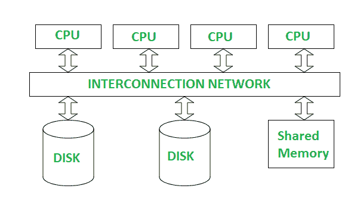
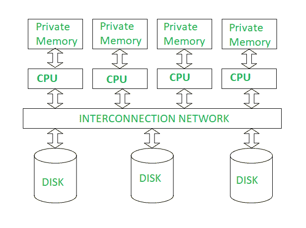
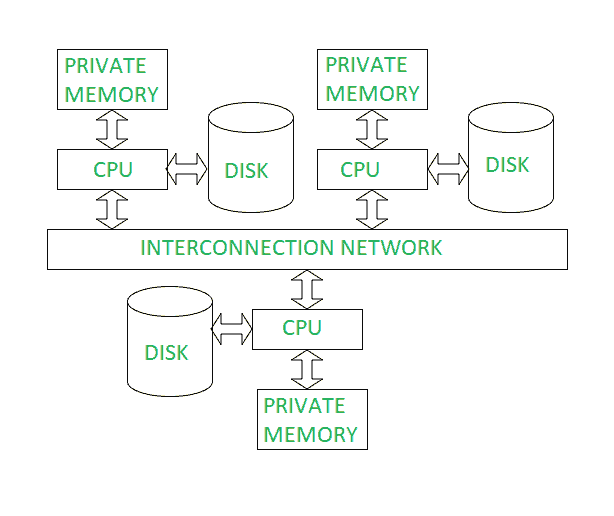

# 并行数据库设计|数据库管理系统

> 原文:[https://www . geesforgeks . org/并行数据库设计-dbms/](https://www.geeksforgeeks.org/design-of-parallel-databases-dbms/)

并行数据库管理系统是一种运行在多个处理器或中央处理器上的数据库管理系统，主要用于尽可能并行地执行查询操作。并行数据库管理系统链接多个较小的机器，以实现与单个大型机器预期相同的吞吐量。

在并行数据库中，主要有三种并行数据库管理系统的架构设计。它们如下:

1.  **共享内存架构**
2.  **共享磁盘架构**
3.  **无共享架构**

让我们一个接一个地讨论它们:

**1。共享内存架构-** 在共享内存架构中，有多个 CPU 连接到一个互连网络。它们能够共享单个或全局主存储器和公共磁盘阵列。需要注意的是，在这种架构中，多线程操作系统和多线程数据库管理系统的单个副本可以支持这些多个 CPU。此外，共享内存是一种固态耦合架构，其中多个 CPU 共享它们的内存。也被称为**对称多处理(SMP)** 。这种架构的范围非常广，从个人工作站开始，通过 RISC 并行支持几个微处理器。

共享内存架构

**优势:**

1.  它可以为有限数量的处理器提供高速数据访问。
2.  沟通是有效率的。

**缺点:**

1.  它不能并行使用超过 80 或 100 个 CPU。
2.  总线或互连网络由于大量 CPU 的增加而阻塞。

**2。共享磁盘体系结构:**
在共享磁盘体系结构中，各种中央处理器连接到一个互连网络。在这种情况下，每个中央处理器都有自己的内存，它们都可以访问同一个磁盘。此外，请注意，这里的内存不是在 CPU 之间共享的，因此每个节点都有自己的操作系统和数据库管理系统副本。共享磁盘体系结构是一种松散耦合的体系结构，针对本质上集中的应用程序进行了优化。它们也被称为**集群**。

共享磁盘架构

**优势:**

1.  互连网络不再是瓶颈每个 CPU 都有自己的内存。
2.  负载平衡在共享磁盘架构中更容易。
3.  有更好的容错能力。

**缺点:**

1.  如果中央处理器的数量增加，干扰和内存争用的问题也会增加。
2.  还有一个可伸缩性问题。

**3、无共享架构:**
无共享架构是多处理器架构，其中每个处理器都有自己的内存和磁盘存储。在这种情况下，多个中央处理器通过一个节点连接到一个互连网络。此外，请注意，没有两个 CPU 可以访问同一个磁盘区域。在这种体系结构中，不共享内存或磁盘资源。也被称为**大规模并行处理(MPP)。**

无共享架构

**优势:**

1.  它具有更好的可扩展性，因为没有共享资源
2.  可以添加多个中央处理器

**缺点:**

1.  通信的成本更高，因为它涉及数据发送和两端的软件交互
2.  非本地磁盘访问的成本高于共享磁盘体系结构的成本。

请注意，该技术通常用于大小为 10 12 字节或 TB 的超大型数据库，或者用于每秒处理数千个事务的系统。