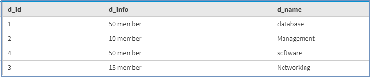
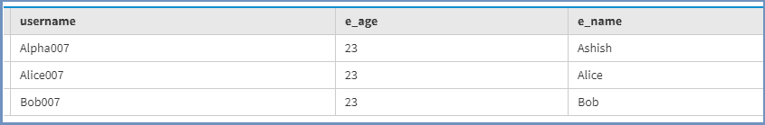
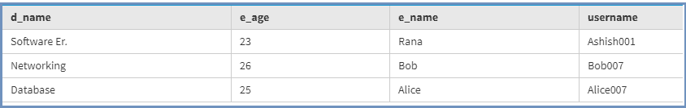
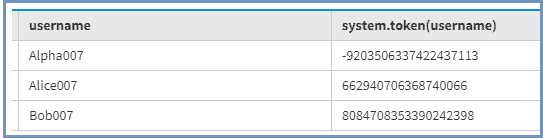

# 在卡珊德拉设计模型

> 原文:[https://www . geesforgeks . org/design-models-in-Cassandra/](https://www.geeksforgeeks.org/designing-models-in-cassandra/)

先决条件–[卡珊德拉介绍](https://www.geeksforgeeks.org/apache-cassandra-nosql-database/)、[数据建模概述](https://www.geeksforgeeks.org/overview-of-data-modeling-in-apache-cassandra/)
在本文中，我们将讨论如何在卡珊德拉中设计模型。造型设计是任何应用的关键部分之一。因此，让我们讨论如何为任何应用程序创建更好的模型，并通过一个示例来看看我们如何做到这一点。

正如您将看到的，Cassandra 在数据建模方面与关系数据库管理系统建模有不同的方法。我们可以在讨论数据建模时看到差异。在 RDBMS 中，我们可以在创建表时执行 JOINS，还可以通过在相关表中使用外键来避免重复。

在 Cassandra 中，我们可以说事实并非如此，Cassandra 是一个分布式系统，我们可以在需要的地方对数据进行反规范化。在关系数据库管理系统中，我们可以通过连接检索和获取数据，而在卡珊德拉中，这可能很昂贵，因为我们可以通过分区键检索数据，而在卡珊德拉中，数据跨越卡珊德拉中的节点。

**设计模型时牢记目标–**

*   **数据的均匀分布:**
    在集群中，数据的均匀分布是关键目标之一，对于单个列，主键是分区键，对于复合主键，分区键是分区键和集群键。我们应该在唯一性的基础上有一个主键(PK)，例如，我们可以说像 ID、电子邮件、用户名应该被选择作为 PK，因此，在这种情况下，节点集群将被充分利用。
*   **最小化读取次数:**
    在 Cassandra 中，我们必须提前知道系统中需要的查询，然后相应地设计模型。在 Cassandra 中，如果单个查询从多个分区获取数据，那么这可能会影响系统性能，从而降低系统速度。在关系数据库管理系统中，我们有这样的自由，我们可以先设计模式，然后创建查询，展示它与非关系模型的区别。

**使用案例:**
访问网站的人数和管理层想要以下给出的详细信息。让我们看看。

1.  所有员工列表
2.  所有域的列表。
3.  按域列出的员工列表

现在，让我们一个一个地创建这个表。首先，我们将创建表域。

```
CREATE TABLE Domain (
 D_id int,
 D_name text,
 D_info text,
 PRIMARY KEY(D_id)
); 
```

现在，我们将创建雇员表。

```
CREATE TABLE Employee (
 username Varchar,
 E_name text,
 E_age int,
 PRIMARY KEY(username)
); 
```

现在，我们将向域表中插入一些数据。

```
INSERT INTO Domain(D_id, D_name, D_info) 
VALUES (1, 'database', '50 member');

INSERT INTO Domain(D_id, D_name, D_info) 
VALUES (2, 'Management', '10 member');

INSERT INTO Domain(D_id, D_name, D_info) 
VALUES (3, 'Networking', '15 member');

INSERT INTO Domain(D_id, D_name, D_info) 
VALUES (4, 'software', '50 member'); 
```

现在，我们将向 Employee 表中插入一些数据。

```
INSERT INTO Employee(username, E_name, E_age) 
VALUES ('Alpha007', 'Ashish', 23);

INSERT INTO Employee(username, E_name, E_age) 
VALUES ('Alice007', 'Alice', 23);

INSERT INTO Employee(username, E_name, E_age) 
VALUES ('Bob007', 'Bob', 23); 
```

在关系数据库管理系统的情况下，我们可以在雇员表中使用域标识作为外键，通过 JOIN 我们可以获得数据，但是我们正在卡珊德拉中设计模型。因此，在卡珊德拉的情况下，我们必须创建另一个表，这将满足需求的要求。

```
CREATE TABLE Employees_by_Domains (
 username varchar,
 E_name text,
 D_name  text,
 E_age int,
 PRIMARY KEY(D_name, E_age)
); 
```

在“按域列出的员工”表中，主键由两部分组成，第一部分是主键 D_name，第二部分是聚类键 E_age，记录按 E_age 进行聚类。

```
insert into Employees_by_Domains(username, E_name, D_name, E_age) 
VALUES ('Ashish001', 'Rana', 'Software Er.', 23);

insert into Employees_by_Domains(username, E_name, D_name, E_age) 
VALUES ('Alice007', 'Alice', 'Database', 25);

insert into Employees_by_Domains(username, E_name, D_name, E_age) 
VALUES ('Bob007', 'Bob', 'Networking', 26); 
```

现在，我们将看到每个表的结果，并根据用例获取数据。
我们来看看。

要查看域表的结果，请使用下面给出的 CQL 查询。

```
Select * 
from Domain; 
```

**输出:**



要查看雇员表的结果，请使用下面给出的 CQL 查询。

```
Select * 
from Employee; 
```

**输出:**



要查看雇员的结果，请使用下面给出的 CQL 查询。

```
Select * 
from Employees_by_Domains; 
```

**输出:**



要获取令牌值，请使用下面给出的 CQL 查询。

```
select token(username) 
from Employee; 
```

**输出:**



每个令牌值对于每个用户名都是唯一的，令牌将跨节点传播。当我们执行以下查询时:

```
SELECT * 
FROM Employee 
where username = 'Alpha007' 
```

它将返回数据，并根据此(-9203506337422437113)标记值选择节点。