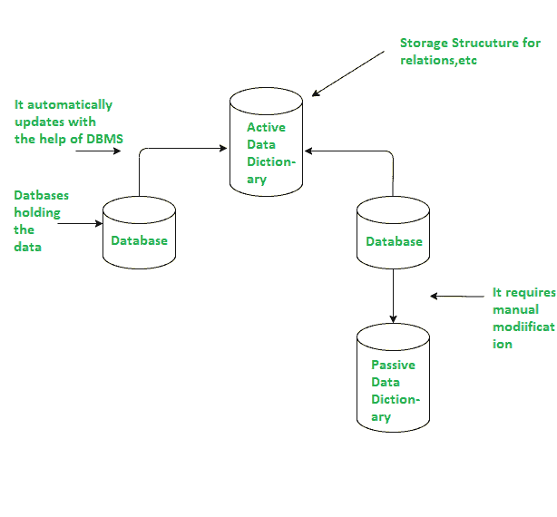

# 主动和被动数据字典的区别

> 原文:[https://www . geesforgeks . org/主被动数据差异词典/](https://www.geeksforgeeks.org/difference-between-active-and-passive-data-dictionary/)

**先决条件–**[**数据字典上的简短注释**](https://www.geeksforgeeks.org/short-note-on-data-dictionary/)

数据字典是磁盘存储的一部分，主要用于存储数据库结构的元数据。为了有效地实现这些数据字典，应该非常重视开发一个好的设计。数据字典可以定义为数据库的所有数据元素或内容的信息集合，例如数据类型、系统的文本描述。它使用户和分析师更容易使用数据，也更容易理解和掌握关于输入、输出、数据库组件和中间计算的常识。

数据字典有两种类型，即主动数据字典和被动数据字典，我们在下面讨论了这两者之间的区别。

**1。活动数据字典:**
活动数据字典是一种非常一致的字典，由数据库管理系统自动管理。在活动数据字典中，当数据库管理系统执行任何修改或更改时，该字典也会自动被数据库管理系统修改。借助数据库管理系统自动更新信息的功能，数据库结构的任何变更或修改也可以在数据字典中看到。在这个字典中，在修改过程中或者当我们更改数据库中的一些数据时，会对数据库的结构产生一些影响。

这种数据字典的好处是它不需要任何外部维护软件或工具，并且由于数据库管理系统自动管理这种字典，因此维护数据字典没有额外的成本。

**2。被动数据字典:**
这个数据字典也有集中元数据的存储。此外，对被动数据字典中数据库的结构(意味着该结构可以修改)没有影响，这与主动数据字典的情况相同。被动数据字典的缺点之一是它不需要任何专用软件来更新或修改。这种字典的另一个缺点是，它需要大量的维护成本，还需要其他团队手动维护数据库，如果这个过程没有正确完成或处理，那么数据库和数据字典就有可能不同步。此外，这个数据字典对于许多用户来说不是一个选择，因为它不容易作为活动字典来维护。

主动和被动数据字典的结构

**主动和被动数据字典的区别:**

<figure class="table">

| **活动数据字典** | **被动数据字典** |
| 数据库管理系统自动维护活动数据字典。 | 每当数据库的结构改变时，被动数据字典就会被修改。 |
| 活动数据字典与数据库的结构和定义非常一致。 | 由于维护或修改的过程是手动的，因此它与数据库的当前结构不一致，也不更新。 |
| 这本字典的另一个名字是综合数据字典。 | 该词典的另一个名称是非集成词典或独立词典。 |
| 数据库管理系统自动管理这个字典。 | 用户负责手动管理本词典。 |
| 它不需要任何单独的数据库。 | 使用本词典需要一个单独的数据库。 |
| 大多数情况下，关系数据库管理系统(RDBMS)包含这种类型的字典，因为它可以很容易地从它们的系统目录中导出。 | 因为被动数据字典需要一个单独的数据库，所以它允许程序员保持独立于使用特定的关系数据库管理系统。 |
| 它没有提供良好的用户界面。 | 它为您提供了友好的用户界面。 |
| 活动数据字典中的信息是最新的，因为它是自动管理的。 | 被动数据字典中的信息不是最新的，因为它是由用户手动管理的。 |

</figure>