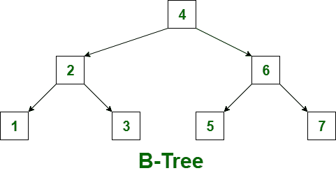
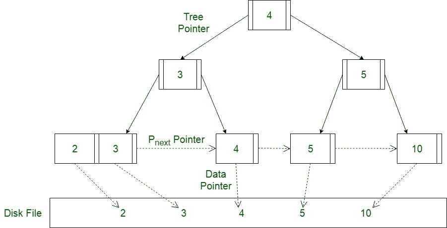

# B 树和 B+树的区别

> 原文:[https://www . geesforgeks . org/b-tree 和 B- tree 的区别/](https://www.geeksforgeeks.org/difference-between-b-tree-and-b-tree/)

**[B- Tree](https://www.geeksforgeeks.org/introduction-of-b-tree-2/):**
B- Tree 被称为自平衡树，因为它的节点在有序遍历中排序。在 B 树中，一个节点可以有两个以上的子节点。b 树的高度为 logM ^ N(其中‘M’是树的阶，N 是节点数)。每次更新时高度都会自动调整。在 B 树中，数据按特定顺序排序，最低值在左边，最高值在右边。在 B 树中插入数据或键比二叉树更复杂。

有一些条件必须由 B 树保持:

*   B 树的所有叶节点必须在同一级别。
*   在 B 树的叶节点之上，不应该有空的子树。
*   b 树的高度应该尽可能低。

**[b+ Tree](https://www.geeksforgeeks.org/introduction-of-b-tree/)**
b+ Tree 通过仅在树的叶节点存储数据指针，消除了用于索引的 B-tree 的缺点。因此，B+树的叶节点结构与 B 树的内部节点结构有很大不同。这里可以注意到，由于数据指针只出现在叶节点，叶节点必须存储所有键值以及它们对应的指向磁盘文件块的数据指针，以便访问它们。此外，叶节点被链接以提供对记录的有序访问。因此，叶节点构成索引的第一级，内部节点构成多级索引的其他级。叶节点的一些键值也出现在内部节点中，只是作为控制记录搜索的媒介。

我们来看看 B-树和 B+树的区别:

| S.NO | b 树 | B+树 |
| --- | --- | --- |
| 1. | 所有内部节点和叶节点都有数据指针 | 只有叶节点有数据指针 |
| 2. | 因为不是所有的键在 leaf 上都可用，所以搜索通常需要更多的时间。 | 所有键都在叶节点，因此搜索更快更准确.. |
| 3. | 树中不维护重复的键。 | 维护密钥的副本，并且所有节点都出现在叶节点上。 |
| 4. | 插入需要更多的时间，而且有时不可预测。 | 插入更容易，结果总是一样的。 |
| 5. | 删除内部节点是非常复杂的，树必须经历很多转换。 | 删除任何节点都很容易，因为所有节点都在叶节点上。 |
| 6. | 叶节点不会存储为结构链表。 | 叶节点存储为结构链表。 |
| 7. | 不存在冗余搜索关键字.. | 可能存在冗余的搜索关键字.. |