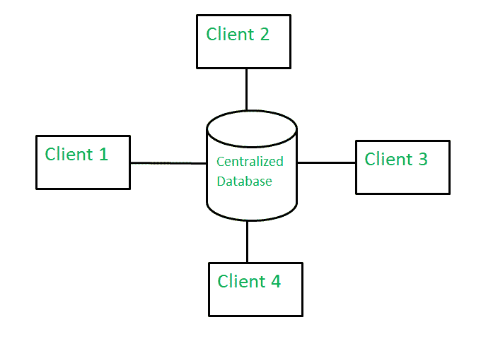
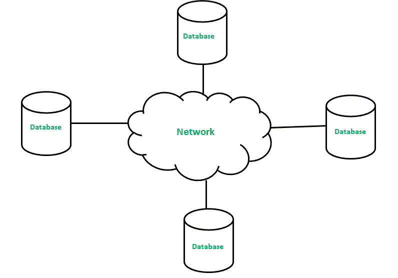

# 集中式数据库和分布式数据库的区别

> 原文:[https://www . geesforgeks . org/集中式数据库和分布式数据库的区别/](https://www.geeksforgeeks.org/difference-between-centralized-database-and-distributed-database/)

**1。集中式数据库:**
集中式数据库基本上是一种只在单一位置存储、定位和维护的数据库。这种类型的数据库是从该位置本身修改和管理的。因此，该位置主要是任何数据库系统或中央计算机系统。通过互联网连接(局域网、广域网等)访问集中位置。这个集中式数据库主要由机构或组织使用。

**优势–**

*   由于所有数据只存储在一个位置，因此更容易访问和协调数据。
*   集中式数据库的数据冗余非常少，因为所有数据都存储在一个地方。
*   与所有其他可用的数据库相比，它更便宜。

**缺点–**

*   集中式数据库的数据流量较多。
*   如果集中式系统出现任何类型的系统故障，那么整个数据都将被销毁。

**2。分布式数据库:**
分布式数据库基本上是一种由多个数据库组成的数据库，这些数据库相互连接并分布在不同的物理位置。因此，存储在不同物理位置的数据可以独立于其他物理位置进行管理。因此，不同物理位置的数据库之间的通信是通过计算机网络完成的。

**优势–**

*   该数据库可以轻松扩展，因为数据已经分布在不同的物理位置。
*   分布式数据库可以很容易地从不同的网络访问。
*   与集中式数据库相比，这个数据库更安全。

**缺点–**

*   该数据库非常昂贵，并且由于其复杂性而难以维护。
*   在这个数据库中，很难向用户提供统一的视图，因为它分布在不同的物理位置。

**集中式数据库和分布式数据库的区别:**

<figure class="table">

| 没有 | 集中式数据库 | 分布式数据库 |
| --- | --- | --- |
| 1. | 它是一个只在一个位置存储、定位和维护的数据库。 | 它是一个由多个数据库组成的数据库，这些数据库相互连接并分布在不同的物理位置。 |
| 2. | 在多个用户的情况下，数据访问时间更多是在集中式数据库中。 | 在分布式数据库中，多个用户的数据访问时间更短。 |
| 3. | 该数据库的管理、修改和备份更容易，因为整个数据都在同一个位置。 | 该数据库分布在不同的物理位置，因此管理、修改和备份非常困难。 |
| 4. | 该数据库为用户提供了统一完整的视图。 | 由于它分布在不同的位置，因此很难向用户提供统一的视图。 |
| 5. | 与分布式数据库相比，该数据库具有更高的数据一致性。 | 该数据库可能有一些数据复制，因此数据一致性较差。 |
| 6. | 如果发生数据库故障，用户将无法访问数据库。 | 在分布式数据库中，如果一个数据库出现故障，用户可以访问其他数据库。 |
| 7. | 集中式数据库成本较低。 | 这个数据库非常昂贵。 |

</figure>