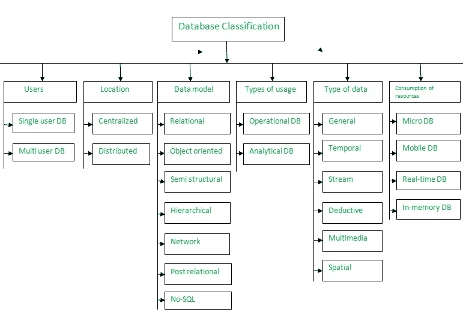

# 数据库管理系统中分类和聚类的区别

> 原文:[https://www . geesforgeks . org/DBMS 中分类和聚类的区别/](https://www.geeksforgeeks.org/difference-between-classification-and-clustering-in-dbms/)

**1。群集:**
数据库群集是将连接到单个数据库的多个服务器或实例组合在一起的过程。有时，一台服务器可能不足以管理数据量或请求数量，也就是说，当需要数据集群时。SQL 是用于管理数据库信息的语言。集群有不同的形式，这取决于数据是如何存储和分配资源的。

**2。数据库分类:**
数据库管理系统可以根据数据模型、用户数、数据库分布等几个标准进行分类，如下图所示。

**数据库管理系统中分类和聚类的区别:**

| 分类 | 使聚集 |
| --- | --- |
| 这一切都是为了在输入数据给定的情况下预测输出。 | 这完全是根据数据点之间的相似性和与其他数据点的不同之处将数据点分组在一起。 |
| 提供带标签的数据。 | 提供了未标记的数据。 |
| 这个模型函数将数据分类到一个定义好的类中。 | 该函数将数据映射到多个集群之一，其中数据项的排列依赖于它们之间的相似性。 |
| 在分类中，通过分析类别标签已知的数据对象来对数据进行分组。 | 聚类分析数据对象而不知道类标签。 |
| 每个分类的属性都有一些先验知识。 | 没有形成聚类的数据属性的先验知识。 |
| 这是通过根据输入数据的值对输出进行分类来实现的。 | 因为输出不是预定义的，所以只对输入数据进行分组。 |
| 分类前已知类别数量，因为有基于输入数据的预定义输出。 | 聚类前不知道聚类的数量。这些在聚类完成后被识别。 |
| 它被认为是监督学习，因为类标签是已知的。 | 它被认为是无监督学习，因为它们没有类标签的先验知识。 |

