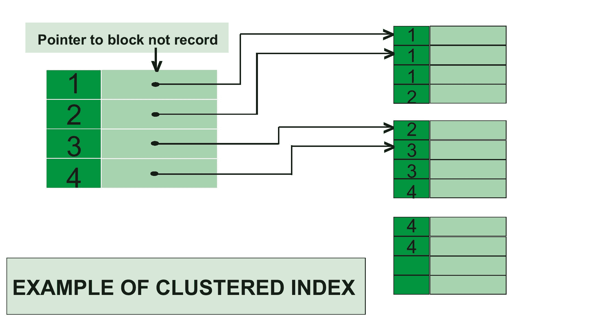
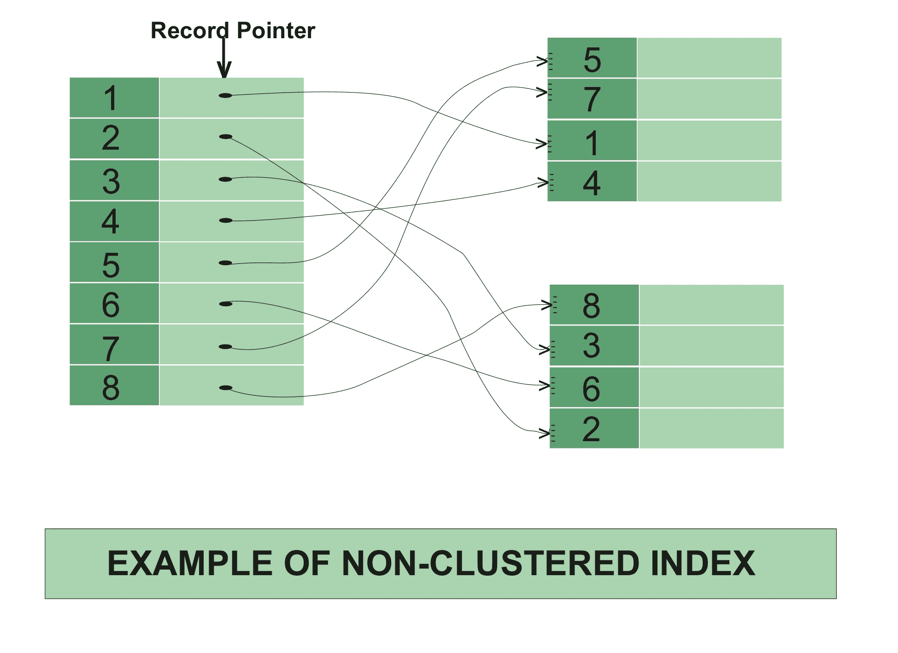

# 聚集索引和非聚集索引的区别

> 原文:[https://www . geesforgeks . org/聚集索引和非聚集索引之间的差异/](https://www.geeksforgeeks.org/difference-between-clustered-and-non-clustered-index/)

先决条件–[对聚集索引和非聚集索引的 SQL 查询](https://www.geeksforgeeks.org/sql-queries-on-clustered-and-non-clustered-indexes/)

**1。聚集索引:**
聚集索引仅在满足以下两个条件时创建–

1.  移动到辅助内存中的数据或文件应该是按顺序或排序的。
2.  应该有一个键值，意思是不能有重复的值。

每当在表中应用聚集索引时，它将只在该表中执行排序。在像主键这样的表中，只能创建一个聚集索引。聚集索引与字典相同，在字典中数据按字母顺序排列。

在聚集索引中，索引包含指向块的指针，但不包含直接数据。



**聚集索引示例–**
如果您将主键应用于任何列，那么它将自动成为聚集索引。

```
create table Student
( Roll_No int primary key, 
Name varchar(50), 
Gender varchar(30), 
Mob_No bigint );

insert into Student
values (4, 'ankita', 'female', 9876543210 );

insert into Student 
values (3, 'anita', 'female', 9675432890 );

insert into Student 
values (5, 'mahima', 'female', 8976453201 ); 
```

在本例中，Roll no 是主键，它将自动充当聚集索引。
该代码的输出将按照辊号的递增顺序产生

<figure class="table">

| 滚动 _ 否 | 名字 | 性别 | 暴民 _ 否 |
| --- | --- | --- | --- |
| three | 安尼塔 | 女性的 | Nine billion six hundred and seventy-five million four hundred and thirty-two thousand eight hundred and ninety |
| four | 安塔 | 女性的 | Nine billion eight hundred and seventy-six million five hundred and forty-three thousand two hundred and ten |
| five | 马希马 | 女性的 | Eight billion nine hundred and seventy-six million four hundred and fifty-three thousand two hundred and one |

一个表中只能有一个聚集索引，但在多列上可以有一个聚集索引，这种类型的索引称为复合索引。

**2。非聚集指数:**
非聚集指数类似于一本书的指数。一本书的索引由章节名称和页码组成，如果你想阅读任何主题或章节，那么你可以使用该书的索引直接转到该页。不需要浏览一本书的每一页。

数据存储在一个地方，索引存储在另一个地方。因为数据和非聚集索引是分开存储的，所以一个表中可以有多个非聚集索引。

在非聚集索引中，索引包含指向数据的指针。



**非聚集索引示例–**

```
create table Student
( Roll_No int primary key, 
Name varchar(50), 
Gender varchar(30), 
Mob_No bigint );

insert into Student 
values (4, 'afzal', 'male', 9876543210 );

insert into Student 
values (3, 'sudhir', 'male', 9675432890 );

insert into Student 
values (5, 'zoya', 'female', 8976453201 );

create nonclustered index NIX_FTE_Name
on Student (Name ASC); 
```

这里，roll no 是主键，因此自动有一个聚集索引。
如果我们想在 NAME 列中应用非聚集索引(升序)，那么将为该列创建新表。

应用非聚集索引前的输出:

<figure class="table">

| 滚动 _ 否 | 名字 | 性别 | 暴民 _ 否 |
| --- | --- | --- | --- |
| three | 苏希尔 | 男性的 | Nine billion six hundred and seventy-five million four hundred and thirty-two thousand eight hundred and ninety |
| four | 阿夫扎尔 | 男性的 | Nine billion eight hundred and seventy-six million five hundred and forty-three thousand two hundred and ten |
| five | 卓娅 | 女性的 | Eight billion nine hundred and seventy-six million four hundred and fifty-three thousand two hundred and one |

应用非聚集索引后的输出:

<figure class="table">

| 名字 | 行址 |
| --- | --- |
| 阿夫扎尔 | Three thousand four hundred and fifty-two |
| Sudhir | Five thousand six hundred and forty-three |
| 卓娅 | Nine thousand eight hundred and seventy-six |

使用行地址是因为，如果有人想在数据中搜索 sudhir，那么通过使用行地址，他/她将直接转到该行地址，并可以直接获取数据。

**聚集指数和非聚集指数的区别:**

<figure class="table">

| CLUSTERED INDEX | 非聚集索引 |
| --- | --- |
| 聚集索引更快。 | 非聚集索引较慢。 |
| 聚集索引需要较少的内存用于操作。 | 非聚集索引需要更多内存用于操作。 |
| 在聚集索引中，索引是主要数据。 | 在非聚集索引中，索引是数据的副本。 |
| 一个表只能有一个聚集索引。 | 一个表可以有多个非聚集索引。 |
| 聚集索引具有在磁盘上存储数据的固有能力。 | 非聚集索引没有在磁盘上存储数据的固有能力。 |
| 聚集索引存储指向块而不是数据的指针。 | 非聚集索引存储值和指向保存数据的实际行的指针。 |
| 在聚集索引中，叶节点是实际数据本身。 | 在非聚集索引中，叶节点不是实际的数据本身，而是只包含包含的列。 |
| 在聚集索引中，聚集键定义表中数据的顺序。 | 在非聚集索引中，索引键定义了索引中数据的顺序。 |
| 聚集索引是一种索引类型，其中表记录被物理地重新排序以匹配索引。 | 非聚集索引是一种特殊类型的索引，其中索引的逻辑顺序与磁盘上行的物理存储顺序不匹配。 |

</figure>

</figure>

</figure>

</figure>