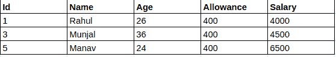

# SQL 中提交和回滚的区别

> 原文:[https://www . geesforgeks . org/SQL 中提交和回滚的区别/](https://www.geeksforgeeks.org/difference-between-commit-and-rollback-in-sql/)

**1。** **COMMIT-**
COMMIT 在 SQL 中是一种事务控制语言，用于将事务中所做的更改永久保存在表/数据库中。执行[提交后，数据库无法恢复到之前的状态。](https://www.geeksforgeeks.org/sql-transactions/)

**示例:**考虑以下包含记录的 STAFF 表:

**STAFF**


```
sql> 
SELECT *
FROM Staff
WHERE Allowance = 400;

sql> COMMIT; 
```

**输出:**



因此，SELECT 语句产生了由三行组成的输出。

**2。回滚**

SQL 中的 ROLLBACK 是一种事务控制语言，用于撤消尚未保存在数据库中的事务。该命令仅用于撤消自上次提交以来的更改。

**示例:**考虑以下包含记录的 STAFF 表:

**STAFF**


```
sql> 
SELECT *
FROM EMPLOYEES
WHERE ALLOWANCE = 400;

sql> ROLLBACK; 
```

**输出:**


因此，SELECT 语句产生了与 ROLLBACK 命令相同的输出。

## **提交和回滚的区别**

<figure class="table">

|   | 犯罪 | 反转 |
| --- | --- | --- |
| 1. | COMMIT 永久保存当前事务所做的更改。 | 回滚撤消当前事务所做的更改。 |
| 2. | 事务无法在 COMMIT 执行后撤消更改。 | 事务在回滚后达到其先前的状态。 |
| 3. | 当事务成功时，应用 COMMIT。 | 当事务中止时，发生回滚。 |

</figure>