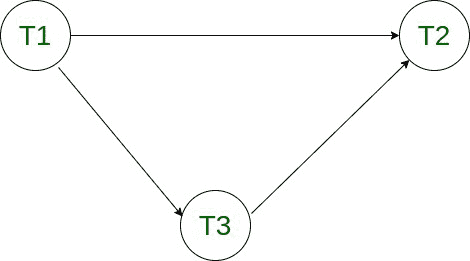
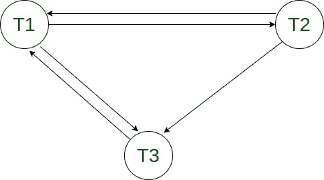
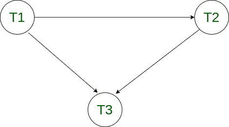

# 冲突和视图可序列化的区别

> 原文:[https://www . geeksforgeeks . org/冲突和视图之间的差异-可串行化/](https://www.geeksforgeeks.org/difference-between-conflict-and-view-serializability/)

先决条件–[数据库管理系统中的计划类型](https://www.geeksforgeeks.org/types-of-schedules-in-dbms/)

**可串行化调度:**
如果事务调度的结果等于其事务的结果是串行执行的，即在时间上没有重叠的顺序执行，则事务调度是可串行化的。可序列化的计划总是使数据库处于一致状态。串行计划始终是可序列化的计划，因为新事务只有在旧事务完成执行时才开始。

**示例–**
让我们考虑以下时间表，看看它是否可序列化。

<figure class="table">

| 一种网络的名称(传输率可达 1.54mbps) | T2 |
| --- | --- |
|   | R(X) |
| R(X) |   |
|   | 右(右) |
|   | W(Y) |
| 右(右) |   |
| W(X) |   |

</figure>

现在，让我们弄清楚上面的时间表是否是可序列化的。

1.  交换 T1 的 R(X)和 T2 的 R(Y)。
2.  交换 T1 的 R(X)和 T2 的 W(Y)。

<figure class="table">

| 一种网络的名称(传输率可达 1.54mbps) | T2 |
| --- | --- |
|   | R(X) |
|   | 右(右) |
|   | W(Y) |
| R(X) |   |
| 右(右) |   |
| W(X) |   |

因此，在改变了初始调度中的冲突操作之后，我们得到了一个串行调度。因此，该计划是可序列化的。

**可序列化计划的类型:**

1.  结果等效时间表
2.  [冲突等价调度或冲突可串行化](https://www.geeksforgeeks.org/conflict-serializability-in-dbms/)
3.  [查看同等计划或查看可序列化性](https://www.geeksforgeeks.org/view-serializability-in-dbms-transactions/)

**冲突和视图可序列化的区别:**

<figure class="table">

| 没有。 | 冲突可串行化 | 视图可序列化性 |
| --- | --- | --- |
| 1. | 如果两个调度中的所有冲突操作都以相同的顺序执行，则称这两个调度是冲突等价的。如果一个调度是与其串行调度等价的冲突，那么它被称为冲突可串行化调度。 | 如果两个计划中的初始读取、最终写入和更新操作的顺序相同，则称这两个计划是视图等效的。如果一个时间表是与其串行时间表等效的视图，那么它被称为视图可序列化时间表。 |
| 2. | 如果计划是视图可序列化的，那么它可能是冲突可序列化的，也可能不是。 | 如果计划是冲突可序列化的，那么它也是视图可序列化的计划。 |
| 3. | 通过重新排序两个事务的操作可以很容易地实现冲突等价，因此，冲突可串行化很容易实现。 | 视图等价很难实现，因为两个事务应该以相似的方式执行相似的操作。因此，视图可序列化很难实现。 |
| 4. | 对于一个事务 T1 写了一个没有其他人读取的值 A，但是后来一些其他事务说 T2 写了它自己的值 A，W(A)不能放在它从不被读取的位置下。 | 如果一个事务 T1 写了一个没有其他事务读取的值 A(因为后来一些其他事务说 T2 写了它自己的值 A)，那么 W(A)可以放在调度的位置，在那里它永远不会被读取。 |

**冲突可串行化示例–**
让我们考虑以下事务调度，并测试它的冲突可串行化

<figure class="table">

| 一种网络的名称(传输率可达 1.54mbps) | T2 | T3 |
| --- | --- | --- |
|   | R(X) |   |
|   |   | R(X) |
| W(Y) |   |   |
|   | W(X) |   |
|   |   | 右(右) |
|   | W(Y) |   |

现在，我们将列出所有冲突的操作。此外，我们将使用[优先图](https://www.geeksforgeeks.org/precedence-graph-for-testing-conflict-serializability-in-dbms/)来确定调度是否是冲突可串行化的。

如果属于不同的事务，对相同的数据进行操作，并且其中至少有一个操作是写操作，则这两个操作被称为是冲突的。

1.  R3(X)和 W2(X) [ T3 -> T2 ]
2.  W1(Y)和 R3(Y) [ T1 -> T3 ]
3.  W1(Y)和 W2(Y) [ T1 -> T2 ]
4.  R3(Y)和 W2(Y) [ T3 -> T2 ]

构造优先图，我们看到图中没有循环。因此，计划是冲突可序列化的。



可序列化的时间表是，

```
T1 -> T3 -> T2 
```

**视图可串行化示例–**
让我们考虑以下事务调度，并测试它的视图可串行化。

<figure class="table">

| 一种网络的名称(传输率可达 1.54mbps) | T2 | T3 |
| --- | --- | --- |
| 皇家艺术学院 |   |   |
|   | 西(阿) |   |
|   |   | 皇家艺术学院 |
| 西(阿) |   |   |
|   |   | 西(阿) |

我们知道，如果一个调度是冲突可串行化的，那么它也是视图可串行化的。所以首先让我们检查冲突可串行化。

该计划的冲突操作是–

1.  R1(甲)和 W2(甲)[ T1 -> T2 ]
2.  R1(甲)和 W2(甲)[ T1 -> T3 ]
3.  W2(A)和 R3(A) [ T2 -> T3 ]
4.  W2(A)和 W1(A) [ T2 -> T1 ]
5.  W2(A)和 W3(A) [ T2 -> T3 ]
6.  R3(A)和 W1(A) [ T3 -> T1 ]
7.  W3(A)和 W1(A) [ T1 -> T3 ]

构建调度中冲突操作的优先图。



正如我们可以看到的，在优先图中有一个循环，这意味着给定的调度不是冲突可序列化的。现在，在检查盲写时，我们得到在给定的时间表中存在盲写 W2(A)。因此，计划可以是视图可序列化的，也可以不是。

为了检查视图的可序列化性，我们将绘制一个时间表的[依赖图](https://www.geeksforgeeks.org/polygraph-to-check-view-serializabilty-in-dbms/)。根据给定的时间表，我们得出以下几点:

1.  T1 在 T2 更新 A 之前读取 A，因此，T1 必须在 T2 之前执行。
2.  T3 对 A 进行最后的更新，因此，它最终必须执行。

构建依赖图。



由于图中不存在循环，我们可以说给定的计划是视图可序列化的。
可序列化的时间表是 T1 - > T2 - > T3。

</figure>

</figure>

</figure>

</figure>