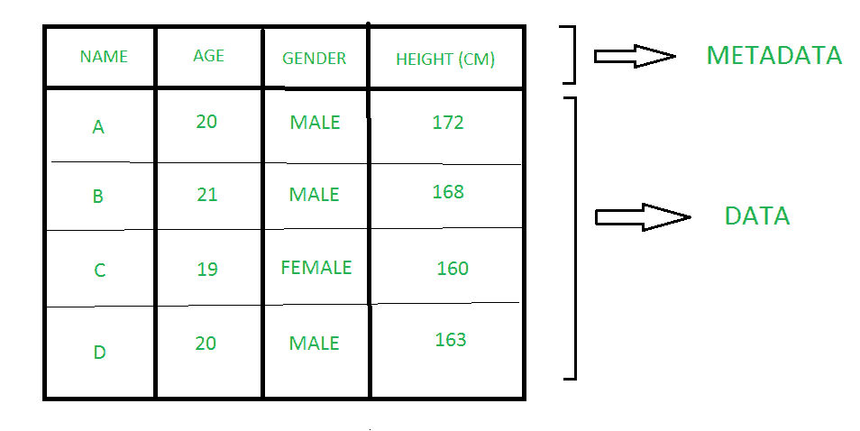

# 数据和元数据的区别

> 原文:[https://www . geesforgeks . org/数据和元数据之间的差异/](https://www.geeksforgeeks.org/difference-between-data-and-metadata/)

**1。数据:**
数据一词源于拉丁语“数据”，指的是“给定的东西”。数据是原始的、无组织的事实，没有适当的处理和组织它们来检索一些信息以备将来使用，这些事实是无用的。数据是一组可以操作、参考或分析的事实和统计数据。它可以只是一条信息、一份杂货清单、或者观察、一个故事或者对某个场景的描述。

**2。**
元数据是关于数据的数据。元数据显示关于数据的基本信息，这可以使查找和处理数据的特定实例变得更加容易。元数据提高了从大量数据中搜索和操作数据的准确性。元数据提供了关于原始数据组织的信息，这有助于从数据束中获取大量所需的数据。它可以手动创建，也可以通过自动信息处理创建。手动处理的元数据比自动信息处理的元数据更准确，因为自动信息处理的元数据只包含文件名、大小、扩展名、创建时间以及关于谁创建了文件的信息。

**数据和元数据的区别:**

| 没有 | 工厂 | 数据 | [计]元数据 |
| --- | --- | --- | --- |
| 1. | 概念 | 数据是存储在计算机内存中的任何种类的信息。这些信息以后可以用于网站、应用程序或将来使用。 | 元数据描述了数据的相关信息。 |
| 2. | 信息 | 数据可能提供信息，也可能不提供信息。 | 元数据总是信息丰富的。 |
| 3. | 处理 | 数据可能已被处理，也可能未被处理。 | 它总是一个经过处理的数据。 |
| 4. | 储存；储备 | 在数据库管理系统中，数据以导航或层次形式存储为文件。 | 它存储在数据字典中。 |
| 5. | 描述 | 在数据库管理系统中，数据是指单独或作为一个集合存储在数据库中的所有单个项目。 | 元数据是指属性的名称、类型、用户约束、完整性信息和存储信息。 |
| 6. | 例子 | 如果您创建了记事本文件，那么该文档的内容就是数据。 | 如果创建记事本文件，文件名、存储描述、文件类型、文件大小都将成为文件的元数据。 |

