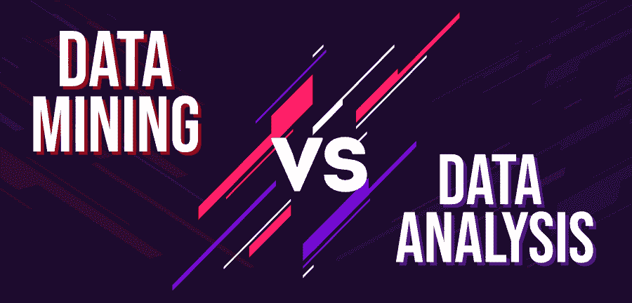

# 数据挖掘和数据分析的区别

> 原文:[https://www . geesforgeks . org/数据挖掘和数据分析之间的区别/](https://www.geeksforgeeks.org/difference-between-data-mining-and-data-analysis/)

**1。数据分析:**
数据分析涉及数据的提取、清理、转换、建模和可视化，目的是提取重要和有用的信息，这些信息可能对得出结论和做出选择有额外的帮助。

数据分析的主要目的是在原始数据中搜索出一些重要信息，因此派生的知识通常用于创建重要的选择。

**2。数据挖掘:**
数据挖掘可以称为数据分析的一个子集。发现重要的模式和规律，是对庞大知识的探索和分析。

数据挖掘也可以是识别和发现整个大数据集中隐藏模式和数据的系统和连续方法。此外，它用于构建机器学习模型，这些模型将进一步用于人工智能。

下面是数据挖掘和数据分析的区别表:

<figure class="table">

| 基于 | 数据挖掘 | 数据分析 |
| --- | --- | --- |
| **定义** | 它是从大数据集中提取重要模式的过程。 | 它是分析和组织原始数据以确定有用信息和决策的过程 |
| **功能** | 它用于发现原始数据集中的隐藏模式。 | 在这种情况下，所有的操作都涉及到检查数据集以得出精确的结论。 |
| **数据集** | 在这个数据集中，一般都是大型的，结构化的。 | 数据集可以是大型、中型或小型的，也可以是结构化的、半结构化的、非结构化的。 |
| **车型** | 通常需要数学和统计模型 | 分析和商业智能模型 |
| **可视化** | 它通常不需要可视化 | 当然需要数据可视化。 |
| **目标** | 首要目标是使数据可用。 | 它用于做出数据驱动的决策。 |
| **所需知识** | 它涉及机器学习、统计和数据库的交叉。 | 它需要计算机科学、统计学、数学、学科知识和机器学习的知识。 |
| **又称** | 它也被称为数据库中的知识发现。 | 数据分析可分为描述性统计、探索性数据分析和验证性数据分析。 |
| **输出** | 它显示了数据趋势和模式。 | 输出被验证或被丢弃的假设 |

</figure>