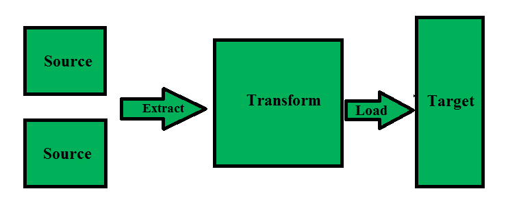
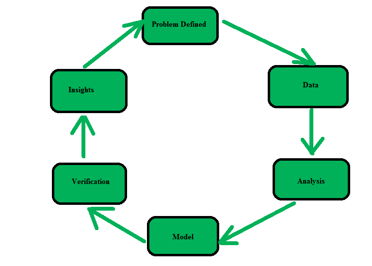

# 数据仓库和数据挖掘的区别

> 原文:[https://www . geesforgeks . org/数据仓库和数据挖掘的区别/](https://www.geeksforgeeks.org/difference-between-data-warehousing-and-data-mining/)

数据仓库的建立是为了支持管理功能，而数据挖掘是用来从数据中提取有用的信息和模式。数据仓库是将信息编译成数据仓库的过程。

**[数据仓库](https://www.geeksforgeeks.org/data-warehousing/) :**
它是一种聚合来自一个或多个来源的结构化数据的技术，以便进行比较和分析，而不是事务处理。A **数据仓库**旨在通过提供一个数据清理、数据集成和数据整合的平台来支持管理决策过程。数据仓库包含面向主题的、集成的、时变的和非易失的数据。

数据仓库整合了来自多个来源的数据，同时确保数据质量、一致性和准确性。数据仓库通过将分析处理与跨国数据库分离来提高系统性能。数据从各种数据库流入数据仓库。数据仓库通过将数据组织成描述数据布局和类型的模式来工作。查询工具使用模式分析数据表。

**Figure –** Data Warehousing process

**[数据挖掘](https://www.geeksforgeeks.org/data-mining/) :**
它是在大数据集中寻找模式和相关性以识别数据之间关系的过程。数据挖掘工具允许商业组织预测客户行为。数据挖掘工具用于构建风险模型和检测欺诈。数据挖掘用于市场分析和管理、欺诈检测、公司分析和风险管理。

**Figure –** Data Mining process

**数据挖掘与数据仓库的比较:**

| 数据库 | 数据挖掘 |
| 数据仓库是为分析而不是事务性工作而设计的数据库系统。 | 数据挖掘是分析数据模式的过程。 |
| 数据定期存储。 | 数据定期分析。 |
| 数据仓库是提取和存储数据的过程，以便于报告。 | 数据挖掘是使用模式识别逻辑来识别模式 |
| 数据仓库仅由工程师执行。 | 数据挖掘由业务用户在工程师的帮助下进行。 |
| 数据仓库是将所有相关数据汇集在一起的过程。 | 数据挖掘被认为是从大型数据集中提取数据的过程。 |

