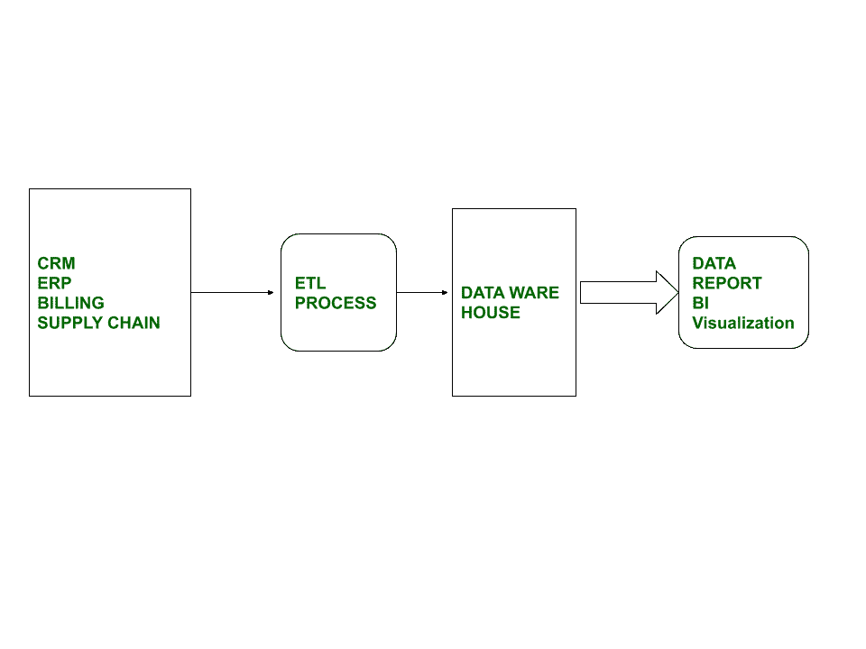
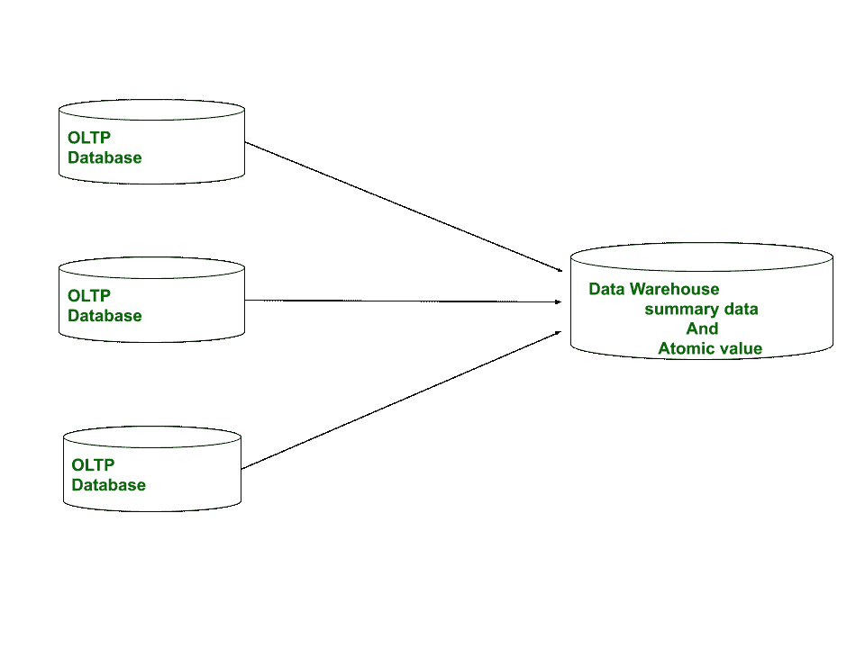

# 数据仓库和在线事务处理(OLTP)的区别

> 原文:[https://www . geeksforgeeks . org/数据仓库和在线交易处理的区别-oltp/](https://www.geeksforgeeks.org/difference-between-data-warehousing-and-online-transaction-processing-oltp/)

**1。[数据仓库](https://www.geeksforgeeks.org/data-warehousing/) :**
它是一种将来自不同来源的数据收集或收集到中央存储库中的技术，或者简单地说，我们可以说它是从不同来源获得的单一、完整和一致的数据存储。它是一个强大的数据库模型，增强了用户分析巨大多维数据集的能力，使用户能够根据事实做出业务决策，并跟踪快速有效的决策或提供必要的信息。

**2。[在线事务处理(OLTP)](https://www.geeksforgeeks.org/on-line-transaction-processing-oltp-system-in-dbms/) :**
这是一种用于详细的日常事务数据的技术，这些数据每天都保持链接。它是大量的短网上交易。其中有详细的当前数据或模式用于存储事务数据库，如(3NF)。它使用传统的数据库，包括插入、删除、更新以及支持查询需求。

**数据仓库和在线事务处理的区别:**

| DWH 数据仓库 | 在线交易 |
| 这是一种将来自不同来源的数据收集到中央存储库中的技术。 | 这是一种用于详细的日常交易数据的技术，它每天都保持链接。 |
| 它是为决策过程设计的。 | 它是为商业交易过程而设计的。 |
| 它存储大量数据或历史数据。 | 它保存当前数据。 |
| 它用于分析业务。 | 它是用来做生意的。 |
| 在数据仓库中，数据库的大小约为 100GB-2TB。 | 在线交易处理中，数据库的大小在 10MB-100GB 左右。 |
| 在数据仓库中，存在非规范化数据。 | 在线交易处理中，存在标准化数据。 |
| 它使用查询处理。 | 它使用事务处理 |
| 它是面向主题的。 | 它是面向应用的。 |
| 在数据仓库中，存在数据冗余。 | 在联机事务处理中，没有数据冗余。 |

