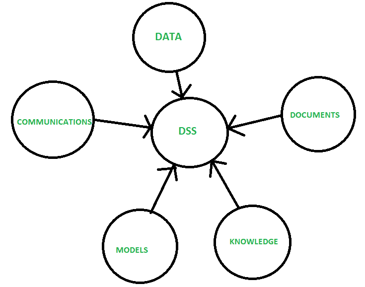
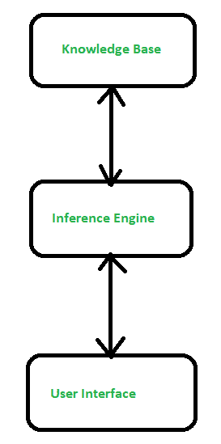

# 决策支持系统与专家系统的区别

> 原文:[https://www . geesforgeks . org/DSS 与专家系统的区别/](https://www.geeksforgeeks.org/difference-between-dss-and-expert-system/)

**1。[决策支持系统(DSS)](https://practice.geeksforgeeks.org/problems/what-is-dss) :**
这是一个基于计算机的系统，帮助决策过程。它是一个交互式、灵活和适应性强的计算机系统。它是专门为支持非结构化管理问题的解决而开发的，以改进决策制定。

决策支持系统是支持业务和组织决策活动的一类特定的计算机化信息系统。

**优势:**

*   它节省时间。
*   提高效率
*   降低成本
*   它提高了个人效率
*   它增加了决策者的满意度。

**缺点:**

*   信息过载
*   地位降低
*   过度强调决策。

**2。[专家系统](https://www.geeksforgeeks.org/expert-systems/) :**
它是一个计算机程序，旨在模仿决策者的决策能力。

它组织了一套关于特定主题的知识。它包含事实和判断知识，这使它能够像人类一样进行猜测。它使用 if-else 结构做出决策时有一套规则。推理机通过操纵知识库进行推理。用户界面向操作员表示问题和信息，并接收操作员的回答。

**优势:**

*   成本降低
*   危险降低了
*   提高可用性
*   表演

**缺点:**

*   如果数据输入不正确，就会产生荒谬的错误。
*   在某些情况下不能提供创造性的反应。
*   它依赖于正确的规则和知识。

**决策支持系统与专家系统的区别:**

| 决策支持系统(Decision Support Systems) | 专家系统 |
| --- | --- |
| 它有助于决策。 | 它使决策自动化。 |
| 决策环境是非结构化的。 | 决策环境是有结构的。 |
| 它从计算机系统中提取或获得知识。 | 向计算机系统注入专家知识。 |
| 问题域的特点是复杂而广泛的。 | 在这方面，它是有限的和专业化的。 |
| 数据操作的类型是数字。 | 数据操作的类型是符号化的。 |
| 它的容量有限。 | 它已经满负荷了。 |
| 它使用目标和系统数据来建立替代方案和结果，因此可以做出一个好的决定。 | 专家系统最终可以取代人类决策者。 |

