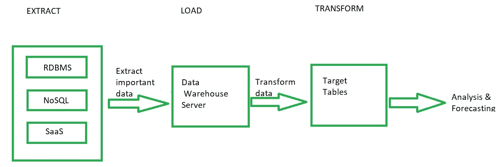
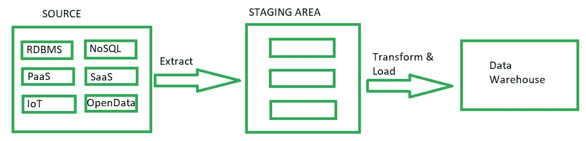

# ELT 和 ETL 的区别

> 原文:[https://www . geesforgeks . org/ELT-and-ETL 之间的差异/](https://www.geeksforgeeks.org/difference-between-elt-and-etl/)

**1。提取、加载和转换(ELT):**
提取、加载和转换(ELT)是从源服务器提取原始数据并将其存储在目标服务器的数据仓库中，并为终端流用户做好准备的技术。

ELT 包括对数据执行的 3 种不同操作:

1.  **提取:**
    提取数据是从一个或多个来源识别数据的技术。来源可以是数据库、文件、企业资源规划、客户关系管理或任何其他有用的数据源。
2.  **加载:**
    加载是将提取的原始数据存储在数据仓库或数据湖中的过程。
3.  **转换:**
    数据转换是将原始数据源转换为分析所需的目标格式的过程。

来自源的数据被提取并存储在数据仓库中。不转换整个数据，但在必要时只进行所需的转换。需要时可以随时从仓库中检索原始数据。然后，根据需要转换的数据被发送到前面进行分析。使用 ELT 时，您可以将源系统中的整个数据集移动到目标系统。这意味着您可以在数据仓库中处理原始数据，这与 ETL 方法不同。

**2。提取、转换和加载(ETL):**
ETL 是提取原始数据，根据需要为用户转换数据并将其存储在数据仓库中的传统技术。后来开发了 ELT，以 ETL 为基础。在 ETL 和 ELT 中发生的三个操作是相同的，只是它们的处理顺序略有不同。这种顺序上的改变是为了克服一些缺点。

1.  **提取:**
    是从数据库、文件、ERP、CRM 或任何其他可用数据源中提取原始数据的过程。
2.  **变换:**
    提取的数据会根据用户要求立即进行变换。
3.  **加载:**
    转换后的数据随后被加载到数据仓库中，用户可以从那里访问它。

从数据源收集的数据直接存储在暂存区中。所需的转换是对临时区域中的数据执行的。一旦数据被转换，结果数据就存储在数据仓库中。ETL 体系结构的主要缺点是，一旦转换后的数据存储在仓库中，就不能再次修改，而在 ELT 中，原始数据的副本总是在仓库中可用，并且只在需要时转换所需的数据。

**ELT 和 ETL 的区别:**

| 英语教学 | 抽取、转换、加载至目的端（extract-transform-load 的缩写） |
| --- | --- |
| 英语教学工具不需要额外的硬件 | ETL 工具需要特定的硬件和它们自己的引擎来执行转换 |
| 大多是 Hadoop 或者 NoSQL 数据库来存储数据。很少使用关系数据库管理系统 | 关系数据库管理系统专门用于存储数据 |
| 由于所有组件都在一个系统中，因此只需加载一次 | 由于 ETL 使用暂存区，加载数据需要额外的时间 |
| 转换数据的时间与数据的大小无关 | 系统必须等待大量数据。随着数据量的增加，转换时间也会增加 |
| 使用 SaaS 解决方案的所有企业都可以获得经济高效的 ans | 对于中小型企业来说不具成本效益 |
| 数据科学家和高级分析师使用转换后的数据 | 转换后的数据由阅读报表的用户和 SQL 编码者使用 |
| 创建临时视图。建造和维护成本低 | 视图是基于多个脚本创建的。删除视图意味着删除数据 |
| 最适合非结构化和非关系数据。非常适合数据湖。适合非常大量的数据 | 最适合关系数据和结构化数据。更适合中小型数据量 |

