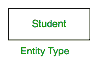
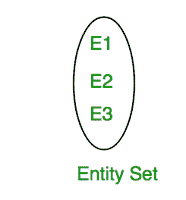

# 实体、实体集、实体类型的区别

> 原文:[https://www . geesforgeks . org/实体-实体-集合-实体-类型的区别/](https://www.geeksforgeeks.org/difference-between-entity-entity-set-and-entity-type/)

[ER 模型](https://www.geeksforgeeks.org/introduction-of-er-model/)是 DBMS 中非常重要的概念，用于从数据角度对系统的逻辑视图进行建模。实体、实体集和实体类型都是 ER 模型中非常重要的概念。在本文中，我们将了解它们之间的区别。

**1。实体:**实体是现实世界中独立存在的事物。一个实体可以独立存在，并且可以与其他对象区分开来。它可以被唯一地识别。

实体可以有两种类型:

*   **有形实体:**物理上存在于现实世界的实体。例如:人、车等。
*   **无形实体:**只在逻辑上存在，没有实体存在的实体。例如:银行账户等。

**示例:**

*   有特定卷号的学生是一个实体。
*   拥有特定注册号的公司是一个实体。

**注:**

*   一个实体可以是具体的，比如学生、一本书，也可以是抽象的，比如一个节日或一个特定的概念。
*   实体由一组属性表示。
*   在关系数据库管理系统的特定关系中，特定的记录被称为实体。

**2。实体类型:**是指特定实体所属的类别。

**示例:**

*   大学数据库中名为 student 的表。
*   公司数据库中名为 employee 的表。

**注:**

*   关系数据库管理系统中特定实体的类别称为实体类型。
*   它由表的名称及其模式表示。

**3。实体集:****实体集是特定实体类型的所有实体在任何时间点的集合或集合。所有实体的类型应该相同。**

****

****示例:****

*   **特定时刻学生表中所有学生的集合就是一个实体集的例子。**
*   **某个特定时刻雇员表中所有雇员的集合就是一个实体集的例子。**

****注:****

*   **实体集不必是不相交的。例如，文章作者的实体集(极客博客的所有内容创建者)和文章阅读器的实体集(所有阅读极客博客文章的学生)可能有共同的成员。**
*   **关系数据库管理系统中所有实体的集合称为实体集。**

****与表的关系:****

**考虑一个学生，如下所示:**

****表名:学生****

<figure class="table">

| 学生标识 | 学生名 | 学生 _ 年龄 | 学生 _ 性别 |
| --- | --- | --- | --- |
| one | Avi | Nineteen | M |
| Two | 阿尤什 | Twenty-three | M |
| three | Nikhil | Twenty-one | M |
| four | 里亚 | Sixteen | F |

****实体:**每行都是一个实体。**

****例:****

<figure class="table">

| one | Avi | Nineteen | M |

****实体类型:**每个实体都属于学生类型。因此，这里的实体类型是学生。**

****实体集:**所有实体的完整数据集称为实体集。对于上表，学号为 1、2、3、4 的记录为实体集。**

****差异表:****

<figure class="table">

| **实体** | **实体类型** | **实体集** |
| --- | --- | --- |
| 现实世界中独立存在的东西 | 特定实体的类别 | 特定实体类型的所有实体的集合。 |
| 关系(表)中的任何特定行(记录)都称为实体。 | 关系数据库管理系统中关系(表)的名称是一种实体类型 | 关系数据库管理系统中关系(表)的所有行都是实体集 |

</figure>

</figure>

</figure>