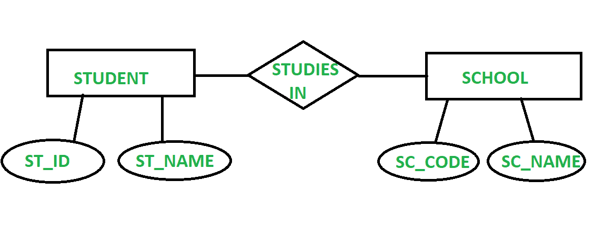

# ER 模型与 RDBMS 的区别

> 原文:[https://www . geesforgeks . org/er-model-和-rdbms 的区别/](https://www.geeksforgeeks.org/difference-between-er-model-and-rdbms/)

**1。 [ER(实体-关系)模型](https://www.geeksforgeeks.org/introduction-of-er-model/) :**
ER 模型代表实体关系模型。它通过给出系统实体之间的关系来指定数据库的结构。实体集是一组彼此相似的实体。它被认为是一种概念设计，可以进一步用于实现数据库。它有助于我们在绘画作品的帮助下以一种简单的方式理解不同实体之间的联系。ER 模型一般是在制作数据库之前构建的。ER 模型用于描述真实世界的实体以及它们之间的关联。

**2。【关系数据库管理系统】:**
关系数据库管理系统代表关系数据库管理系统，它是根据 E.F.Codd 给出的模型为关系数据库设计的数据库管理系统。关系数据库以表格的形式存储结构良好的数据，这使得在需要时更容易检索数据。它拥有高效的数据检索查询处理技术。在关系数据库管理系统中，可以有多个表，这些表可以相互关联。关系数据库管理系统是目前最常用的数据库管理模型。

**ER 模型与 RDBMS 的区别:**

| 没有 | 电流变模型 | 关系型数据库管理系统 |
| --- | --- | --- |
| 1. | ER 模型是一个高级数据模型，它告诉我们实体之间的关系。 | 关系数据库管理系统是一个数据库管理系统，它有一组相互关联的表。 |
| 2. | ER 模型更容易理解，因为它是图片形式。 | 关系数据库管理系统相对比 ER 模型更复杂。 |
| 3. | 在构建数据库之前，先建立 ER 模型，了解数据库的情况。 | 关系数据库管理系统是 ER 图的一个实现。 |
| 4. | ER 模型以属性、实体和关系为主要组成部分。 | 关系数据库管理系统以元组、域、键为主要组成部分。 |
| 5. | ER 模型具有映射基数。 | 关系数据库管理系统没有映射基数。 |
| 7. | 构建 ER 模型需要的技术人员相对较少。 | 处理数据库系统需要更多有技能的人。 |

