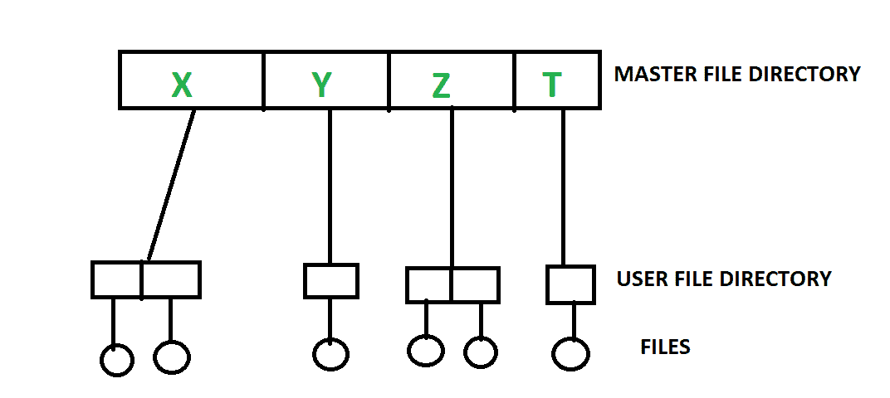
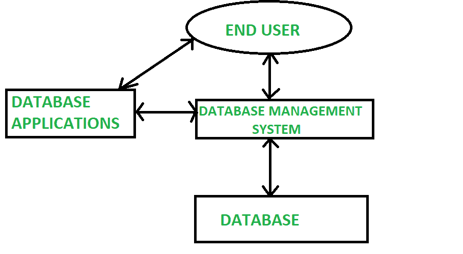

# 文件系统和数据库管理系统的区别

> 原文:[https://www . geesforgeks . org/文件系统和 dbms 之间的区别/](https://www.geeksforgeeks.org/difference-between-file-system-and-dbms/)

先决条件–[文件系统上的数据库管理系统](https://www.geeksforgeeks.org/advantages-of-dbms-over-file-system/)
**1。文件系统:**
文件系统基本上是将文件排列在硬盘等存储介质中的一种方式。文件系统组织文件，并在需要时帮助检索文件。文件系统由分组到目录中的不同文件组成。目录还包含其他文件夹和文件。文件系统执行基本操作，如管理、文件命名、给出访问规则等。

**例:**

```
NTFS(New Technology File System), EXT(Extended File System).
```



**2。DBMS(数据库管理系统):**
数据库管理系统基本上是一个管理相关数据收集的软件。它用于存储数据，并在需要时有效地检索数据。它还提供了适当的安全措施来保护数据免受未经授权的访问。在数据库管理系统中，数据可以通过 SQL 查询和关系代数来获取。它还提供了数据恢复和数据备份机制。

**例:**

```
Oracle, MySQL, MS SQL server.
```



**文件系统和 DBMS 的区别:**

<figure class="table">

| 基础 | 文件系统 | 数据库管理系统 |
| --- | --- | --- |
| 1.结构 | 文件系统是一种管理和组织计算机内存储介质中的文件的软件。 | 数据库管理系统是管理数据库的软件。 |
| 2.数据冗余 | 文件系统中可能存在冗余数据。 | 在数据库管理系统中，没有冗余数据。 |
| 3.备份和恢复 | 如果数据丢失，它不提供备份和恢复。 | 即使数据丢失，它也能提供备份和恢复。 |
| 4.询问处理 | 文件系统中没有有效的查询处理。 | 高效的查询处理存在于数据库管理系统中。 |
| 5.一致性 | 文件系统中的数据一致性较差。 | 由于规范化的过程，数据更加一致。 |
| 6.复杂性 | 与数据库管理系统相比，它没有那么复杂。 | 与文件系统相比，它的处理更加复杂。 |
| 7.安全约束 | 与数据库管理系统相比，文件系统提供的安全性较低。 | 与文件系统相比，数据库管理系统有更多的安全机制。 |
| 8.费用 | 它比数据库管理系统便宜。 | 它的成本相对高于文件系统。 |
| 9.数据独立性 | 没有数据独立性。 | 在数据库管理系统中，数据独立性是存在的。 |

</figure>