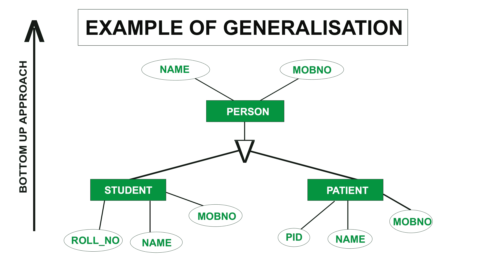
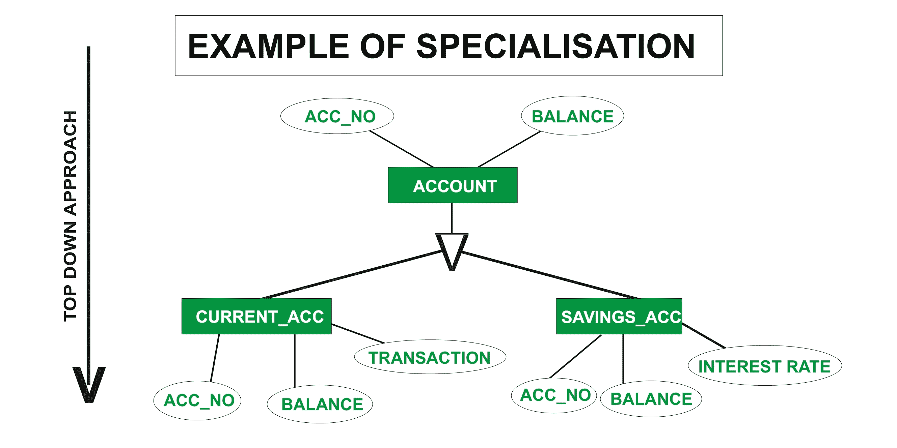

# 数据库管理系统中泛化和专门化的区别

> 原文:[https://www . geeksforgeeks . org/DBMS 中泛化和专门化的区别/](https://www.geeksforgeeks.org/difference-between-generalization-and-specialization-in-dbms/)

一般化和专门化是增强的实体关系图

**1。概括:**
它基于自下而上的方法。在一般化中，较低层次的函数被组合形成较高层次的函数，称为实体。这个过程被进一步重复，以形成高级实体。

在一般化过程中，属性是从特定的实体中提取的，因此我们可以创建一般化的实体。我们可以总结概括过程，因为它结合子类形成超类。

**概括示例–**
考虑两个实体学生和病人。这两个实体会有自己的一些特点。例如，学生实体将具有滚动 _ 号、名称和混乱 _ 号，而患者将具有 PId、名称和混乱 _ 号特征。在这个例子中，学生和病人的名字和号码可以组合成一个人，形成一个更高层次的实体，这个过程被称为概括过程。

**2。**
特殊化我们可以说特殊化是泛化的对立面。在特殊化中，事物被分解成更小的事物来进一步简化它。我们也可以说，在特殊化中，一个特定的实体被分成子实体，这是根据它的特性来完成的。在特殊化中也会发生继承。

**专业化示例–**
考虑一个实体账户。这将有一些属性考虑它们 Acc_No 和 Balance。帐户实体可能有一些其他属性，如往来帐户和储蓄帐户。现在 Current_Acc 可能有 Acc_No、余额和交易，而 Savings_Acc 可能有 Acc_No、余额和利率，因此我们可以说专业实体继承了更高级实体的特征。

在应用一般化和特殊化之后，结果图形的结构是相同的。

**泛化和特化的区别:**

| 一般化 | 专门化 |
| --- | --- |
| 一般化以自下而上的方法工作。 | 专业化采用自上而下的方法。 |
| 概括地说，模式的大小变小了。 | 在专门化中，模式的大小增加了。 |
| 一般化通常适用于一组实体。 | 我们可以对单个实体应用专门化。 |
| 一般化可以定义为从各种实体集创建分组的过程 | 专门化可以定义为在实体集内创建子分组的过程 |
| 在泛化过程中，实际发生的是两个或多个较低级别的实体集的并集产生一个较高级别的实体集。 | 专业化是普遍化的反义词。专门化是取一个较高级实体集的子集来形成一个较低级实体集的过程。 |
| 泛化过程从实体集的数量开始，它借助于一些共同的特征创建高级实体。 | 专门化过程从单个实体集开始，它通过使用一些不同的特性来创建不同的实体集。 |
| 在一般化中，较低实体之间的差异和相似性被忽略以形成较高的实体。 | 在特殊化中，较高的实体被分割成较低的实体。 |
| 泛化没有继承性。 | 专业化有继承性。 |

