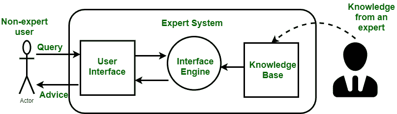
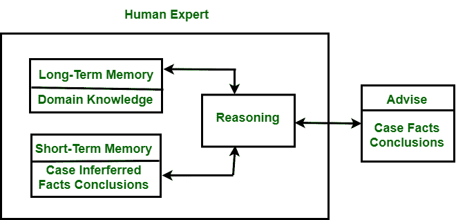

# 人类专家与专家系统的区别

> 原文:[https://www . geesforgeks . org/人-专家-专家-系统的区别/](https://www.geeksforgeeks.org/difference-between-human-expert-and-expert-system/)

**1。[专家系统](https://www.geeksforgeeks.org/expert-systems/) :**
专家系统的另一个名称是**基于知识的系统**。它们用于真实世界的问题，如专家质量建议、诊断和建议。基本上，它是一种计算机程序，用于模拟对特定领域有专业知识和经验的人或组织的判断和行为。建立一个专家系统需要一个提取所需知识的人类专家。

图–专家系统

**2。人类专家:**
人类专家是一个有能力以优越的方式识别事物的人。例如:医生等。

图-人类专家

**人类专家与专家系统的区别:**

| 没有。 | 人类专家 | 专家系统 |
| --- | --- | --- |
| 1. | 用拇指规则或试探法形式的知识来解决狭窄领域的问题。 | 它处理以规则形式表达的知识，并在狭窄的领域中使用符号推理。 |
| 2. | 在人类专家中，我们处理的是知识以汇编形式存在的人脑。 | 它提供了知识与其处理的明确分离。 |
| 3. | 它能够解释推理路线并提供细节。 | 专家系统有助于追踪解决问题过程中产生的规则，并解释如何得出特定结论以及为什么需要特定数据。 |
| 4. | 它使用不精确的推理，也能够处理不完整、不确定和模糊的信息。 | 它允许不精确的推理，但能够处理不完整、不确定和模糊的数据。 |
| 5. | 由于多年的学习和实践训练，它提高了解决问题的质量。 | 它通过添加新规则或调整知识库中的旧规则来提高问题解决的质量，当获得新知识时，变化很容易观察到。 |
| 6. | 人类专家可以在特定的工作日出现。 | 专家系统可以随时随地使用。 |
| 7. | 为了解决任何问题，人类专家可以花可变的时间。 | 要解决任何问题，专家系统需要很短的时间间隔。 |
| 8. | 它是不可替代的。 | 它可以被重新播放。 |

