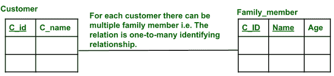
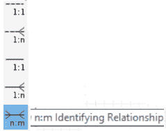
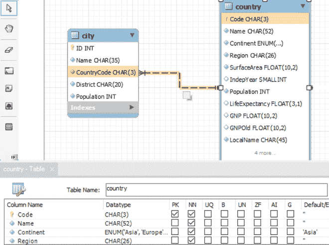
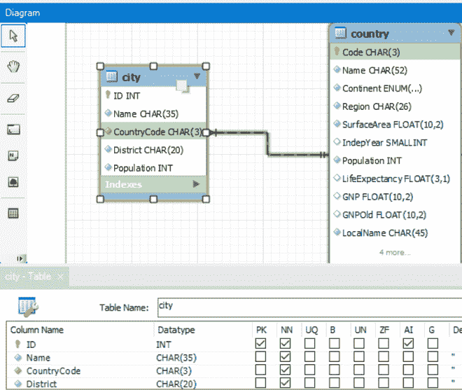

# 识别关系和非识别关系的区别

> 原文:[https://www . geesforgeks . org/识别关系和非识别关系的区别/](https://www.geeksforgeeks.org/difference-between-identifying-and-non-identifying-relationships/)

在本文中，我们将讨论实体的概述以及识别和非识别关系，最后将重点讨论两者之间的差异。我们一个一个来讨论。

**概述:**

*   [没有自己关键属性的实体类型](https://www.geeksforgeeks.org/difference-between-strong-and-weak-entity/)称为弱实体类型。与此不同，有一些常规的实体类型有它们的关键属性，也称为强实体类型。
*   属于弱实体类型的实体在与其他实体相关时被识别，这些实体有自己的关键属性，也称为强实体类型或识别或所有者实体类型。
*   强实体类型的一个或多个关键属性与任意数量的弱实体类型的属性相关联，以便识别它。

**识别关系:**
将弱实体类型与所有者实体类型相关联的关系称为识别关系。弱实体类型在关系中总是有完全参与(存在依赖)，因为没有所有者身份就无法识别弱实体类型。这并不意味着每个存在依赖(全部参与)都会导致弱实体类型。

**识别关系**

**图解说明–**

*   这里家庭成员(实体)是一个弱实体。它没有任何主键。给定所有者 id(即主键 Cust_id)和弱实体的一个或多个属性(即家族成员的名称)，我们可以唯一地标识弱实体关系中的元组。
*   名称不是弱实体中的主键，但它是弱实体中的关键属性。在 ER 图中，弱实体部分键用虚线下划线表示。
*   所有者实体应该始终是一个强实体，所有者和弱实体之间的关系始终是一对多和弱实体的完全参与
*   ER 图中的双菱形框表示一个弱实体与其所有者强实体之间的关系，这种关系称为识别关系。因为这是一对多的关系，对许多方面都是完全参与。所以这里需要两个关系，一个是弱实体，一个是弱实体和弱关系属性。
*   弱实体类型可以有一个以上的标识实体类型和一个大于两个的标识关系类型。
*   标识实体类型有时也称为父实体类型或主导实体类型。弱实体类型有时也称为子实体类型。

**例-1 :**
我们来关注一下电影，导演，和电影 _ 导演的关系。

**需求分析** :
一个导演可以执导多(M)部电影，一部电影可以由多(N)个导演执导。因此，这是 M: N 关系，因此需要该关系来存储该信息。一个关系用于存储电影信息，一个关系用于存储导演信息，一个关系(movies _ directors)中，movie_id 作为电影关系的外键，director_id 作为导演关系的外键，因此，它们有助于引用电影表和导演表，以提供用户指定的查询结果。电影和电影 _ 导演的关系是一个太多(一部电影可以由很多导演执导)，导演和电影 _ 导演的关系也是一个太多(作为一个导演可以执导多部电影)。因此，电影和电影导演之间的关系是确定关系，因为子元素(即电影导演)中的每个元组都依赖于电影关系中存在的条目。同样，导演和电影导演也与确定关系有关。如果我们从电影关系中删除任何条目，那么电影导演中的相应条目也需要删除。

**二元关系符号**

**非标识关系:**
在非标识关系中，父表的一个或多个主属性(即主键的属性)在子表中不作为主属性，但可以归属于子表(即非主属性)。这里，国家(父)表和城市(子)表之间的虚线表示国家和城市之间的非识别关系。可以在没有父实体的情况下唯一标识子实体。

**国家表**

**城市表**

**例** **1** :

*   如果你有作者关系和图书关系。在某些情况下，我们可能需要存储关于一本书的数据，但我们不知道作者是谁。这本书的身份/存在并不取决于作者的信息。
*   在上述非标识关系的示例中，国家实体“代码”属性被用作唯一标识国家关系的主键。这里，国家(即父表)的主键(即代码)出现在城市(即子表)中，但不是主键或主键的一部分。
*   两个关系城市(子)和国家(父)与非标识关系相关联。关系城市有标识作为主键。但是在国家实体中，代码属性被用作唯一标识国家关系的主键。这里，父国家的主键(即代码)存在于城市(即子级)关系中，但不是主键或主属性)。

**非识别关系的部分:**
非识别关系进一步分为如下两部分。

1.  **强制非识别关系**
2.  **可选非识别关系**

我们来讨论一下。

1.  **强制非标识关系–**
    当存在于子关系中的属性父关系不能包含空值时，就存在“强制”非标识关系。

2.  **可选非标识关系–**当也在子关系中的父关系(主属性或主键)的属性包含空值时，两个关系之间存在“可选”非标识关系。

**识别关系与非识别关系的区别:**

<figure class="table">

| 没有。 | 

**识别关系**

 | 

**非识别关系**

 |
| --- | --- | --- |
| 1. | 在标识关系时，父(标识实体类型)的主键被添加到子关系中，子关系的一些属性用于唯一标识子关系中的每个元组，即子表中的元组依赖于父表中的行。 | 在非标识关系中，父表的主属性/数据属性(即主键的属性)在子表中不被用作主属性/属性，但它可以归属于子表(即非主表)。 |
| 2. | **例如–**
上面的例子是用来识别关系的。

*   在该示例中，家庭成员关系中的每个元组(包括像家庭成员的姓名、年龄这样的属性)不能由关系 Family_member 唯一确定。
*   因此，客户主键与一个或多个属性(即名称)相结合，以唯一标识与家庭成员相关的元组。
*   因此，客户(即父表)和家庭成员(子表)之间的关系是确定的(即家庭成员表/关系中的一行取决于客户表中的一行)。
*   这里，C_Id 的组合(即来自父表和家庭成员(子)表中的名称)一起有助于识别家庭成员中的每个元组。

 | **例如–**
在上例中采取了非识别关系。

*   国家实体代码属性用作唯一标识国家关系的主键。
*   这里，作为父表的国家的主键(即代码)出现在城市(即子表)中，但不是主键或主键的一部分。
*   与城市相关的每个元组可以被唯一地标识，而无需参考国家关系。
*   城市和国家之间的关系被定义为“不同的城市可以属于同一个国家”，因此这是多对一的非识别关系，因为关系城市可以用标识(即其主键)唯一识别。

 |

</figure>