# “内部连接”和“外部连接”的区别

> 原文:[https://www . geesforgeks . org/内联接和外联接的区别/](https://www.geeksforgeeks.org/difference-between-inner-join-and-outer-join/)

**JOINS:**
SQL 中的 JOINS 用于在特定条件下组合多个表中的行，这是两个表的列之间的关系。连接有不同的类型，在本文中，让我们介绍一下 INNER JOIN 和 OUTER JOIN 及其区别。

让我们考虑两个表**学生**和**位置**，通过使用不同的连接来梳理表，看看它们的区别会是什么样子。
**表 1–**

<figure class="table">

| **学生证** | **学生 _ 姓名** |
|      12 | 笈多王朝 |
|      16 | Girish |
|      17 | 笈多王朝 |
|      14 | 库纳尔 Kunal |
|      15 | 克利须那 |
|      18 | 萨蒂什 |

学生

**表 2–**

<figure class="table">

| **学生证** | **学生 _ 地点** |
|        12 | 德里 |
|        13 | 马德拉斯 |
|        15 | 泰米尔纳德邦 |
|        14 | 孟买 |
|        16  | 特兰加纳 |
|         20  | 旁遮普地区 |

</figure>

位置

**首先，以 MSSQL 为服务器，创建表并将数据插入表中:**

*   **使用以下查询创建学生表和位置–**

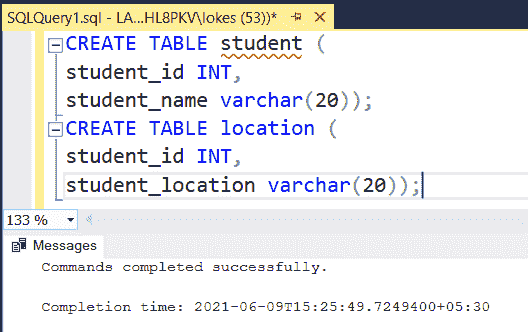

创建了两个表

*   **使用以下查询将行插入学生表和位置–**

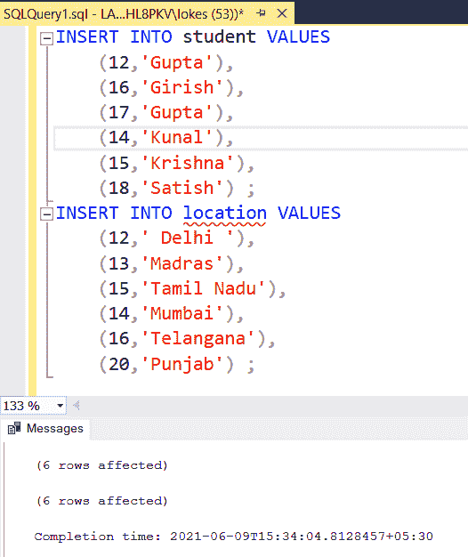

将数据插入表中

*   **使用以下查询查看表格–**

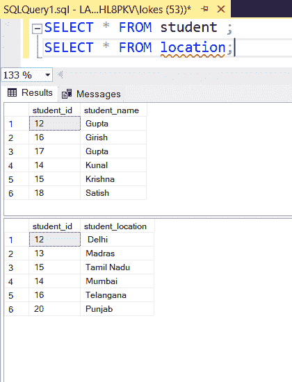

从表中查看数据

**连接类型:**

**1。内部连接**

*   EQUI JOIN
*   自连接

**2。外部连接**

*   左连接
*   右连接
*   完全连接

**1。内部连接:**
当使用内部连接时，它只考虑那些我们希望与表匹配的属性，如果有不匹配的属性，则不会包含在结果表中。
**两种内部连接–**

*   **相等连接–**
    它是内部连接的子类别，在表中只限于相等条件。当且仅当查询中存在相等条件时，该连接称为 Equi 连接。
    查询上述两个表上的 **Equi Join** :

```
SELECT * FROM 
student 
INNER JOIN 
location
ON 
student.student_id = location.student_id;
```

**输出表–**

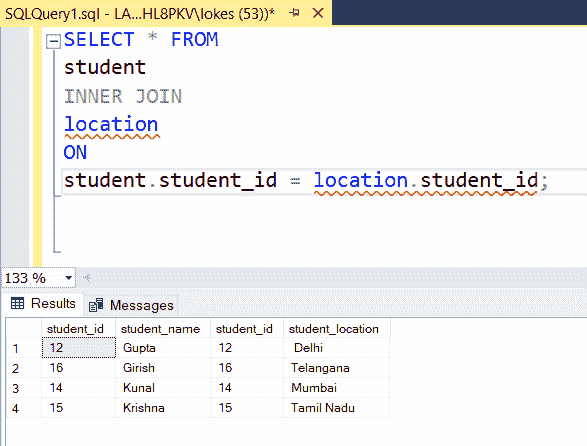

*   **自联接–**
    自联接将同一个表视为另一个表，并在所需条件满足后输出结果表。

对**自连接**的查询在上面两个表中:

```
SELECT s1.student_id ,s1.student_name FROM 
student s1
INNER JOIN 
student s2 
ON 
s1.student_name= s2.student_name AND s1.student_id<> s2.student_id;
```

**输出表–**

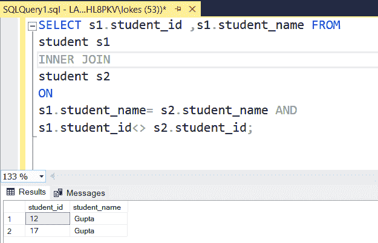

**T2 内部连接的维恩图表示–**

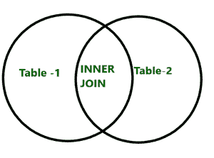

**2。外部连接:**
在外部连接中，我们完全考虑任何一个表或两个表，使得两个表中不匹配的剩余字段保持为空。

**三种外部连接–**
**1。左连接或(左外连接)–**
在左连接中，我们完全考虑左表和右表中匹配的属性(基于条件)，以及左表和右表中不匹配的属性相对于左表中的列被置为空。
左连接的查询在上面两个表中:

```
SELECT * FROM 
student 
LEFT JOIN 
location
ON 
student.student_id = location.student_id;
```

**输出表:**

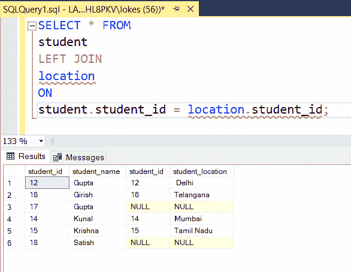

**左侧连接的维恩图表示:**

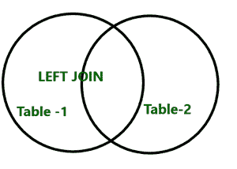

**右**、**连接–**
在右连接中，我们完全考虑右表和左表中匹配的属性(基于条件)，以及右表和左表的不匹配属性相对于右表中的一列为空。
右连接的查询在上面两个表中:

```
SELECT * FROM 
student 
RIGHT JOIN 
location
ON 
student.student_id = location.student_id;
```

**输出表–**

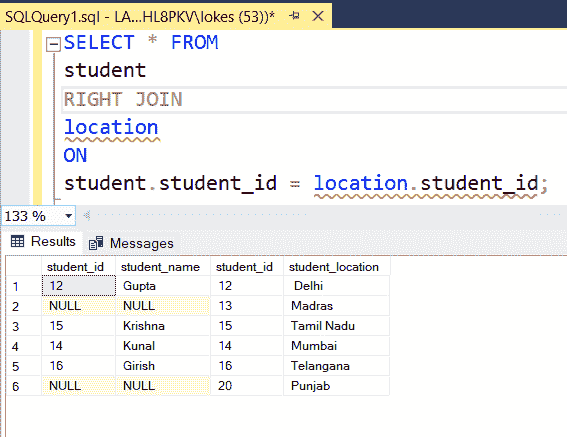

**右侧连接的维恩图表示–**


**完全连接–**
它是左连接和右连接的结合，其中左表和右表的所有列都被认为是左表或右表的不匹配或未找到的属性将在结果表中以空值放置。
完全连接的查询在上面两个表中:

```
SELECT * FROM 
student 
FULL JOIN 
location
ON 
student.student_id = location.student_id;
```

**输出表–**

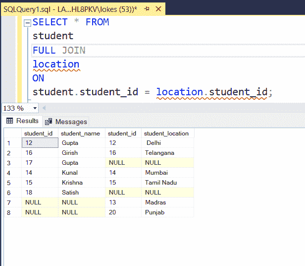

**完全连接的维恩图表示–**

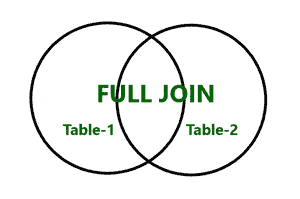

</figure>