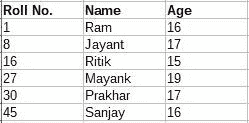
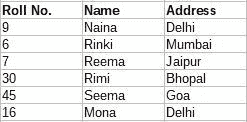
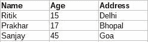
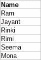

# SQL 中 JOIN 和 UNION 的区别

> 原文:[https://www . geesforgeks . org/SQL 中联接和联合的区别/](https://www.geeksforgeeks.org/difference-between-join-and-union-in-sql/)

:
SQL 中的 JOIN 用于根据多个表之间的匹配条件组合来自这些表的数据。使用 JOIN 语句组合的数据会生成新的列。

考虑两个表:

**男生**



**女生**



**示例:**

```
sql> 
SELECT Boys.Name, Boys.Age, Girls.Address,
FROM Boys 
INNER JOIN Girls 
ON Boys.Rollno = Girls.Rollno; 
```

结果表格为:



**<u>[UNION](https://www.geeksforgeeks.org/sql-union-clause/)</u>**:
UNION 在 SQL 中用于组合两个或多个 SELECT 语句的结果集。使用 UNION 语句组合的数据被转换成新的不同行的结果。

**示例:**

```
sql> 
SELECT Name 
FROM Boys 
WHERE Rollno < 16 

UNION

SELECT Name 
FROM Girls 
WHERE Rollno > 9 
```

结果表格为:



**SQL 中 JOIN 和 UNION 的区别:**

| 加入 | 联盟 |
| --- | --- |
| JOIN 根据许多表之间的匹配条件组合这些表中的数据。 | SQL 组合了两个或多个 SELECT 语句的结果集。 |
| 它将数据组合成新的列。 | 它将数据组合成新的行 |
| 从每个表中选择的列数可能不相同。 | 从每个表中选择的列数应该相同。 |
| 从每个表中选择的相应列的数据类型可以不同。 | 从每个表中选择的相应列的数据类型应该相同。 |
| 它可能不会返回不同的列。 | 它返回不同的行。 |