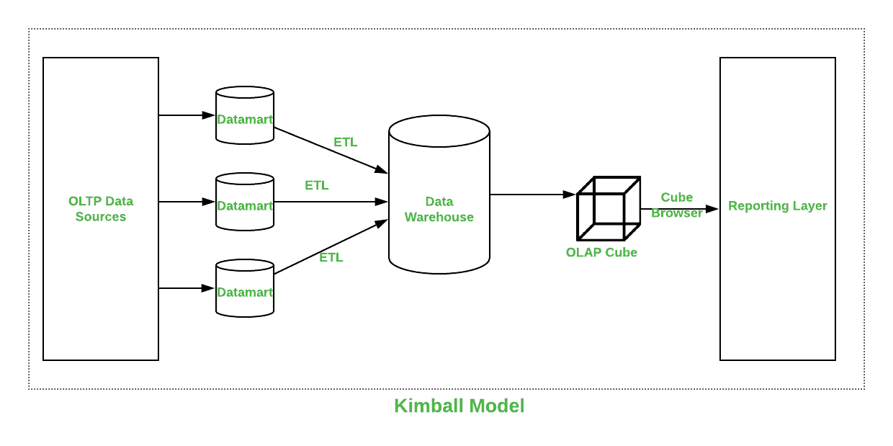
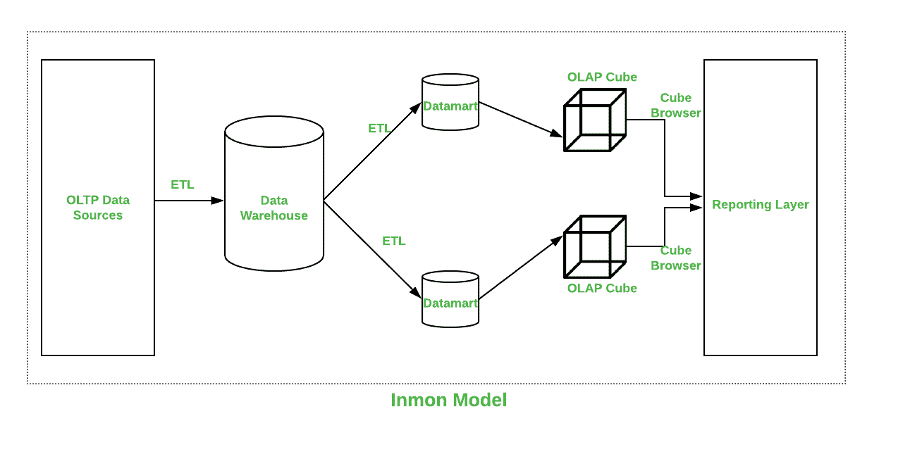

# 金博尔和英蒙的区别

> 原文:[https://www . geeksforgeeks . org/Kimball 和-inmon 之间的区别/](https://www.geeksforgeeks.org/difference-between-kimball-and-inmon/)

设计[数据仓库](https://www.geeksforgeeks.org/data-warehouse-architecture/)是业务发展必不可少的一部分。对于设计，有两种最常见的架构，分别是**金球**和**英蒙**，但问题是哪一种更好，哪一种以低冗余服务用户。让我们在一些因素上比较两者。

**1。T2 设计数据仓库的方法是由拉尔夫·金博尔(T4)引入的。这种方法从识别业务流程和数据仓库必须回答的问题开始。这些信息正在被分析，然后被很好地记录下来。[提取转换加载(ETL)](https://www.geeksforgeeks.org/etl-process-in-data-warehouse/) 软件从多个数据源(称为数据集市)中提取所有数据，然后将其加载到一个称为暂存的公共区域中。然后这个被转换成 OLAP 立方体。**

**应用:**

*   设置和构建很快。
*   根据多星模式生成报告非常成功。
*   数据库操作非常有效。
*   数据库占用空间小，管理容易。

金博尔数据仓库架构如下所示:

**2。英蒙:**
英蒙设计数据仓库的方法是由**比尔·恩门**介绍的。这种方法从企业数据模型开始。这种模式识别关键领域，同时也照顾到客户、产品和供应商。该模型用于创建用于主要操作的详细逻辑模型。细节，模型然后被用来开发一个物理模型。这种模型是标准化的，减少了数据冗余。这是一个复杂的模型，很难用于创建数据集市的业务目的，每个部门都可以将其用于自己的目的。

**应用:**

*   数据仓库对变化非常灵活。
*   业务流程很容易理解。
*   报告可以跨企业处理。
*   ETL 过程非常不容易出错。

英蒙数据仓库架构如下所示:

**金博尔和英蒙的区别:**

| 因素 | 金博尔 | 英诺森 |
| --- | --- | --- |
| 介绍人 | 由拉尔夫·金博尔介绍。 | 由比尔·恩门介绍。 |
| 方法 | 它有自下而上的实现方法。 | 它有自上而下的实现方法。 |
| 数据集成 | 它关注个人业务领域。 | 它关注企业范围的领域。 |
| 建筑时间 | 效率高，耗时少。 | 它很复杂，消耗大量时间。 |
| 费用 | 它具有迭代步骤，并且具有成本效益。 | 初始成本巨大，开发成本低。 |
| 所需技能 | 它不需要这样的技能，但一个通用的团队会做工作。 | 它需要专业技能才能发挥作用。 |
| 维护 | 这里维护困难。 | 在这里维护很容易。 |
| 数据模型 | 它更喜欢数据处于去规范化模型中。 | 它更喜欢将数据放在规范化的模型中。 |
| 数据存储系统 | 在这种情况下，源系统高度稳定。 | 在这种情况下，源系统的变化率很高。 |

