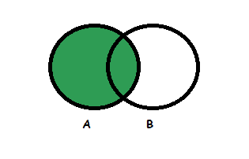
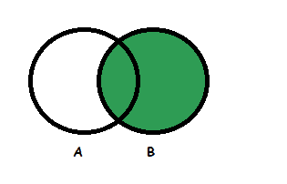
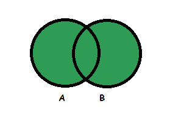

# 左、右和全外连接之间的差异

> 原文:[https://www . geeksforgeeks . org/左-右-和-全-外-连接的区别/](https://www.geeksforgeeks.org/difference-between-left-right-and-full-outer-join/)

数据库管理系统(DBMS)允许使用连接从多个表中检索数据。

[联接](https://www.geeksforgeeks.org/sql-join-set-1-inner-left-right-and-full-joins/)主要是两个或多个关系(或表)的笛卡尔乘积。

SQL 连接大致分为[内部连接和](https://www.geeksforgeeks.org/inner-join-vs-outer-join/)外部连接。内部联接从满足联接条件的表中选择行。但是使用内部连接会丢失两个表中不满足条件的行。外部连接可用于防止表中的数据丢失。

**外连接的类型:**
外连接又分为 3 种:左外连接、右外连接和全外连接。这些解释如下。

1.  **Left Outer Join:**
    Left Outer Join returns all the rows from the table on the left and columns of the table on the right is null padded. Left Outer Join retrieves all the rows from both the tables that satisfy the join condition along with the unmatched rows of the left table.

    **语法:**

    ```
    SELECT [column1, column2, ....]
    FROM   table1

    LEFT OUTER JOIN table2 ON 
    table1.matching_column = table2.matching_column

    WHERE [condition]; 
    ```

    或者

    ```
    SELECT [column1, column2, ....]
    FROM   table1

    LEFT OUTER JOIN table2 
    ON table1.matching_column = table2.matching_column

    WHERE [condition]; 
    ```

    **图解表示:**

    

2.  **Right Outer Join:**
    Right Outer Join returns all the rows from the table on the right and columns of the table on the left is null padded. Right Outer Join retrieves all the rows from both the tables that satisfy the join condition along with the unmatched rows of the right table.

    **语法:**

    ```
    SELECT [column1, column2, ....]
    FROM   table1

    RIGHT OUTER JOIN table2 ON 
    table1.matching_column = table2.matching_column

    WHERE [condition]; 
    ```

    或者，

    ```
    SELECT [column1, column2, ....]
    FROM   table1

    RIGHT OUTER JOIN table2 
    ON table1.matching_column(+) = table2.matching_column

    WHERE [condition]; 
    ```

    **图解表示:**

    

3.  **Full Outer Join:**
    Full Outer Join returns all the rows from both the table. When no matching rows exist for the row in the left table, the columns of the right table are null padded. Similarly, when no matching rows exist for the row in the right table, the columns of the left table are null padded. Full outer join is the union of left outer join and right outer join.

    **语法:**

    ```
    SELECT [column1, column2, ....]
    FROM   table1

    FULL OUTER JOIN table2 
    ON table1.matching_column = table2.matching_column

    WHERE [condition]; 
    ```

    **图解表示:**

    

**例:**
考虑以下员工表，

<center>

| 断续器 | ENAME | EMPDEPT | 薪水 |
| One hundred and one | 阿曼达 | 发展 | Fifty thousand |
| One hundred and two | 月形蝴蝶 | 人力资源（部） | forty thousand |
| One hundred and three | 布鲁斯 | 设计 | thirty thousand |
| One hundred and four | 史蒂夫(男子名) | 测试 | Thirty-five thousand |
| One hundred and five | 罗杰 | 分析师 | ten thousand |

</center>

部门表:

<center>

| 干得好干得好干得好干得好干得好干得好干得好干得好干得好干得好干得好干得好干得好干得好干得好干得好 | DEPTNAME | 位置 |
| Ten | 发展 | 纽约 |
| Eleven | 设计 | 纽约 |
| Twelve | 测试 | 华盛顿 |
| Thirteen | 帮助台 | 洛杉矶 |

</center>

现在，
**1。左外连接查询–**

```
Select empid, ename, deptid, deptname 
from employee 
left outer join department 
on employee.empdept = department.deptname; 
```

输出:

<center>

| 断续器 | ENAME | 干得好干得好干得好干得好干得好干得好干得好干得好干得好干得好干得好干得好干得好干得好干得好干得好 | DEPTNAME |
| One hundred and one | 阿曼达 | Ten | 发展 |
| One hundred and three | 布鲁斯 | Eleven | 设计 |
| One hundred and four | 史蒂夫(男子名) | Twelve | 测试 |
| One hundred and two | 月形蝴蝶 | 空 | 空 |
| One hundred and five | 罗杰 | 空 | 空 |

</center>

**2。右外连接查询–**

```
Select empid, ename, deptid, deptname 
from employee right outer join department 
on employee.empdept = department.deptname;
```

<center>

| 断续器 | ENAME | 干得好干得好干得好干得好干得好干得好干得好干得好干得好干得好干得好干得好干得好干得好干得好干得好 | DEPTNAME |
| One hundred and one | 阿曼达 | Ten | 发展 |
| One hundred and three | 布鲁斯 | Eleven | 设计 |
| One hundred and four | 史蒂夫(男子名) | Twelve | 测试 |
| 空 | 空 | Thirteen | 帮助台 |

</center>

**3。完全外部连接查询–**

```
Select empid, ename, deptid, deptname 
from employee full outer join department 
on employee.empdept = department.deptname;
```

<center>

| 断续器 | ENAME | 干得好干得好干得好干得好干得好干得好干得好干得好干得好干得好干得好干得好干得好干得好干得好干得好 | DEPTNAME |
| One hundred and one | 阿曼达 | Ten | 发展 |
| One hundred and three | 布鲁斯 | Eleven | 设计 |
| One hundred and four | 史蒂夫(男子名) | Twelve | 测试 |
| One hundred and two | 月形蝴蝶 | 空 | 空 |
| One hundred and five | 罗杰 | 空 | 空 |
| 空 | 空 | Thirteen | 帮助台 |

</center>

**左外连接、右外连接、全外连接之间的差异:**

<center>

| 左外连接 | 右外连接 | 完全外部连接 |
| 从左边的表中获取所有行 | 从右边的表中获取所有行 | 从两个表中获取所有行 |
| 内部联接+
左表中所有不匹配的行 | 内部联接+
右表中所有不匹配的行 | 内部联接+
左表中所有不匹配的行+
右表中所有不匹配的行 |
| 右表中不匹配的数据丢失 | 左表不匹配的数据丢失 | 没有数据丢失 |
| 选择[第 1 列，第 2 列，…。】
从表 1
左侧外部连接表 2 打开
表 1 .匹配 _ 列=表 2 .匹配 _ 列 | 选择[第 1 列，第 2 列，…。】
从表 1
右外连接表 2 打开
表 1 .匹配 _ 列=表 2 .匹配 _ 列 | 选择[第 1 列，第 2 列，…。】
从表 1
完全外部连接表 2 打开
表 1 .匹配 _ 列=表 2 .匹配 _ 列 |

</center>