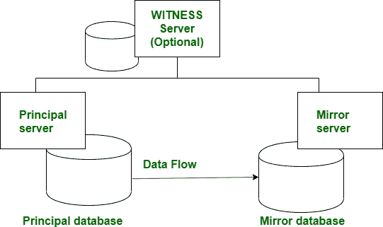
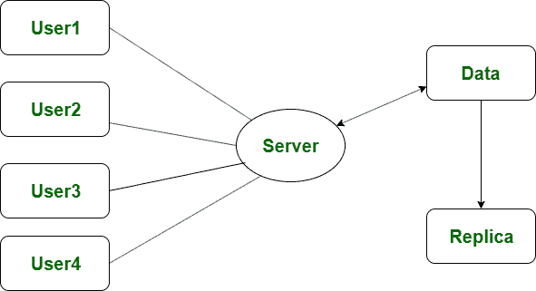

# 镜像和复制的区别

> 原文:[https://www . geesforgeks . org/镜像和复制的区别/](https://www.geeksforgeeks.org/difference-between-mirroring-and-replication/)

**镜像:**
镜像也称为**阴影**，是创建数据和数据库的多个副本的过程。通常在镜像中，数据库被复制到与其主数据库完全不同的机器或位置。如果有任何主服务器因维护而崩溃，那么在那个时候，系统会自动故障转移到镜像数据库。因此，在任何给定的时间，只能获得一个副本。

镜像在数据库上完成。并且不支持分布式数据库。镜像数据库和主数据库之间的紧密耦合是在交易日志到反射数据库的因果块的帮助下建立的。万一出现任何故障，它能够通过将信息从一个数据库重复到另一个数据库来恢复信息。一旦发生任何故障，镜像数据库将成为主要信息。

**[复制](https://www.geeksforgeeks.org/data-replication-in-dbms/) :**
复制是将数据库和数据的对象分布在完全不同的数据库中以促进信息供应的方法。它能够从地理上分散的站点上汇总公司信息，并将信息传播给网络或局域网上的远程用户。这就增加了并行执行。发布者是一个关联实体，它拥有复制到 Microsoft SQL server 中不同服务器的信息。
订户可以是通常从发布者接收复制信息的服务器。复制操作有三种类型的 Microsoft SQL server

*   事务复制
*   合并复制
*   Snapshot replication

**镜像和复制的区别:**

| S.NO | 参数 | 反映 | 分身术 |
| --- | --- | --- | --- |
| 1. | 基础 | 镜像是将数据或数据库复制到不同的位置。 | 而复制是创建数据和数据库对象来增加分发操作。 |
| 2. | 执行于 | 我们对数据库执行镜像。 | 当我们在数据和数据库对象上执行复制时。 |
| 3. | 费用 | 数据库上的镜像操作比复制成本高。 | 而复制的成本比镜像低。 |
| 4. | 分布式数据库 | 镜像不支持分布式数据库。 | 而复制支持分布式数据库。 |
| 5. | 位置 | 通常，镜像数据库是在不同于其主数据库的机器或位置上实现的。 | 在复制过程中，数据库和数据对象保存在另一个数据库中。 |

