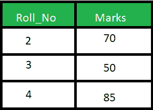
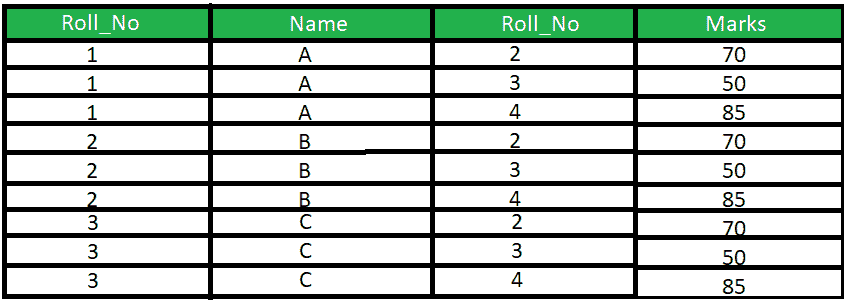

# SQL 中自然连接和交叉连接的区别

> 原文:[https://www . geesforgeks . org/自然连接和交叉连接之间的区别-in-sql/](https://www.geeksforgeeks.org/difference-between-natural-join-and-cross-join-in-sql/)

**1。自然连接:**
自然连接基于相同的属性名和数据类型连接两个表。生成的表将包含两个表的所有属性，但每个公共列只有一个副本。

**示例:**
考虑下面给出的两个表格:

<center>Student Table</center>


<center>Marks Table</center>



考虑给定的查询

```
SELECT * 
FROM Student S NATURAL JOIN Marks M;
```

**输出:**


**2。交叉连接:**
如果没有指定条件，交叉连接将产生两个表的交叉或笛卡尔乘积。生成的表将包含两个表的所有属性，也包括重复或公共列。

**示例:**
考虑以上两个表，查询如下:

```
SELECT * 
FROM Student S CROSS JOIN Marks M; 
```

**输出:**



**SQL 中自然连接和交叉连接的区别**

<center>

| 不，先生。 | 自然连接 | 交叉连接 |
| --- | --- | --- |
| 1. | 自然连接基于相同的属性名和数据类型连接两个表。 | 交叉连接将产生两个表的交叉积或笛卡儿积。 |
| 2. | 在自然连接中，结果表将包含两个表的所有属性，但只保留每个公共列的一个副本 | 在交叉连接中，结果表将包含两个表的所有属性，也包括重复的列 |
| 3. | 在自然连接中，如果没有指定条件，则根据公共列返回行 | 在交叉连接中，如果没有指定条件，那么它将返回两个表中所有可能的行对，不管它们是否匹配 |
| 4. | 语法:
从表 1 自然连接表 2 中选择*； | 语法:
从表 1 选择*交叉连接表 2； |

</center>