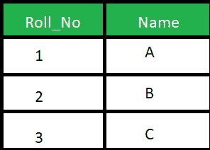

# SQL 中自然连接和内部连接的区别

> 原文:[https://www . geeksforgeeks . org/自然连接和内部连接在 sql 中的区别/](https://www.geeksforgeeks.org/difference-between-natural-join-and-inner-join-in-sql/)

先决条件–[连接(内部、左侧、右侧和完全连接)](https://www.geeksforgeeks.org/sql-join-set-1-inner-left-right-and-full-joins/)
**1。自然连接:**
自然连接基于相同的属性名和数据类型连接两个表。生成的表将包含两个表的所有属性，但只保留每个公共列的一个副本。

**示例:**
考虑下面给出的两个表格:

学生表



标记表


考虑给定的查询

```
SELECT * 
FROM Student NATURAL JOIN Marks;
```

**输出:**


**2。内部连接:**
内部连接基于 on 子句中明确指定的列连接两个表。结果表将包含两个表的所有属性，包括公共列。

**示例:**
考虑以上两个表，查询如下:

```
SELECT * 
FROM student S INNER JOIN Marks M ON S.Roll_No = M.Roll_No; 
```

**输出:**


**SQL 中自然连接和内部连接的区别:**

<figure class="table">

| 不，先生。 | 自然连接 | 内部连接 |
| --- | --- | --- |
| 1. | 自然连接基于相同的属性名和数据类型连接两个表。 | 内部联接基于在 on 子句中明确指定的列联接两个表。 |
| 2. | 在自然连接中，结果表将包含两个表的所有属性，但只保留每个公共列的一个副本 | 在内部连接中，结果表将包含两个表的所有属性，也包括重复的列 |
| 3. | 在自然连接中，如果没有指定条件，则根据公共列返回行 | 在内部连接中，只有存在于两个表中的记录才会返回 |
| 4. | 语法:
从表 1 自然连接表 2 中选择*
；
 | 语法:
在表 1 上从表 1 内部连接表 2 中选择*
。列名=表 2。列名；
 |

[SQL Server 管理工作室](https://www.google.com/search?q=ssms&rlz=1C1GCEB_enIN963IN963&oq=ssms&aqs=chrome..69i57j69i59j0i271l2j69i60l2j69i61j69i60.556j0j7&sourceid=chrome&ie=UTF-8)不支持自然连接，也称为微软 SQL Server。

</figure>