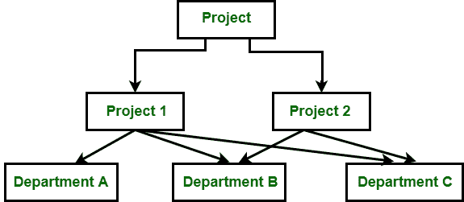
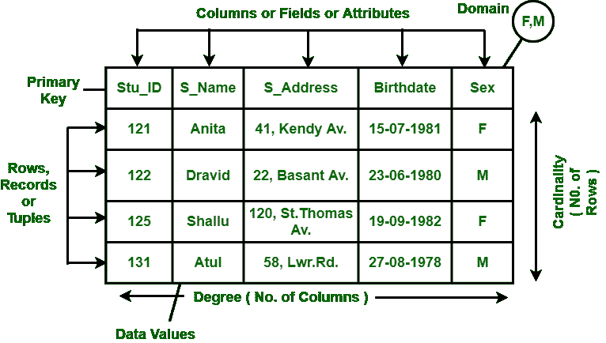

# 网络和关系数据模型的区别

> 原文:[https://www . geesforgeks . org/网络和关系数据模型之间的差异/](https://www.geeksforgeeks.org/difference-between-network-and-relational-data-model/)

**1。网络数据模型:**
是分层数据模型的高级版本。为了组织数据，它使用有向图而不是树形结构。在这个孩子可以有不止一个父母。它使用两种数据结构的概念，即记录和集合。

在上图中，项目是根节点，有两个子节点，即项目 1 和项目 2。项目 1 有 3 个孩子，项目 2 有 2 个孩子。总共有 5 个孩子，即 A 部门、B 部门和 C 部门，他们是网络相关的孩子，正如我们所说的，这种模式可以有多个父母。所以，对于 B 部门和 C 部门有两个家长，即项目 1 和项目 2。

**2。[关系数据模型](https://www.geeksforgeeks.org/relational-model-in-dbms/) :**
关系数据模型由 E.F. Codd 于 1970 年开发。它们没有物理链接，因为它们在分层数据模型中。以下是关系数据模型的属性:

*   数据仅以表格的形式表示。
*   它只处理数据，不处理物理结构。
*   它提供关于元数据的信息。
*   在行和列的交叉点上，元组只有一个值。
*   它提供了一种轻松处理查询的方法。

**网络与关系数据模型的区别:**

| 网络数据模型 | 关系数据模型 |
| --- | --- |
| 它通过链接或指针组织记录。 | 它以表的形式组织记录，表之间的关系是使用公共字段设置的。 |
| 它以有向图的形式组织记录。 | 它以表格的形式组织记录。 |
| 在这种关系中，各种记录通过链表物理地表示。 | 在这种情况下，各种记录之间的关系通过表进行逻辑表示。 |
| 缺少声明性查询工具。 | 它提供了使用 SQL 的声明式查询工具。 |
| 复杂性增加了程序员在数据库设计和数据操作方面的负担。 | 由于物理层面的细节对最终用户是隐藏的，所以这个模型很容易理解。 |
| 检索算法复杂但对称。 | 检索算法简单且对称。 |
| 该模型中存在部分数据独立性。 | 该模型提供了数据独立性。 |
| UNIVAC 的 VAX-数据库管理系统、DMS-1100 和超数据库管理系统都使用这种模型。 | 它主要用于现实世界的应用。甲骨文，SQL。 |

