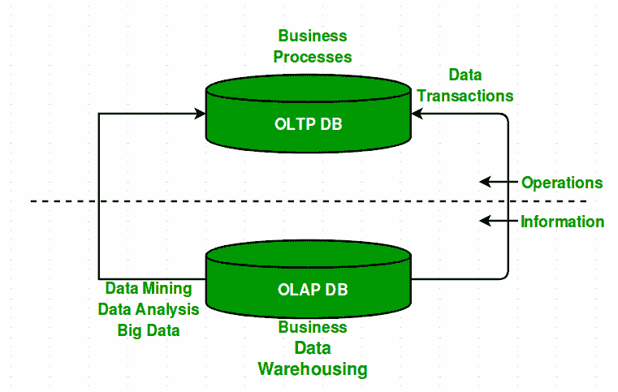

# OLAP 和数据库管理系统中 OLTP 的区别

> 原文:[https://www . geesforgeks . org/OLAP 和 oltp 在 dbms 中的区别/](https://www.geeksforgeeks.org/difference-between-olap-and-oltp-in-dbms/)

**在线分析处理(OLAP)–**
在线分析处理由一种用于业务决策数据分析的软件工具组成。OLAP 提供了一个环境，可以一次从多个数据库系统检索到的数据库中获取见解。

**示例–**任何类型的数据仓库系统都是 OLAP 系统。OLAP 的用途如下:

*   Spotify 对用户的歌曲进行分析，得出他们歌曲和播放列表的个性化主页。
*   网飞电影推荐系统。

**在线事务处理(OLTP)–**
在线事务处理以三层架构提供面向事务的应用。OLTP 管理组织的日常事务。

**示例–**OLTP 的用途如下:

*   ATM 中心是一个 OLTP 应用。
*   OLTP 通过应用程序在数据事务期间处理 ACID 属性。
*   它还用于网上银行、在线机票预订、发送短信、向购物车添加图书。

**OLAP 与 OLTP 的比较–**

<title>oltp</title>

| OLAP(在线分析处理) | 联机事务处理 |
| 由来自各种数据库的历史数据组成。 | 仅包含当前运行数据。 |
| 它是面向主题的。用于数据挖掘、分析、决策等。 | 它是面向应用的。用于业务任务。 |
| 这些数据用于规划、解决问题和决策。 | 数据用于执行日常基本操作。 |
| 它展示了当前业务任务的快照。 | 它提供了不同业务任务的多维视图。 |
| 大量数据通常以 TB、PB 为单位存储 | 随着历史数据的归档，数据的大小相对较小。例如兆字节、千兆字节 |
| 相对较慢，因为涉及的数据量很大。查询可能需要几个小时。 | 非常快，因为查询操作了 5%的数据。 |
| 与 OLTP 相比，它只需要不时进行备份。 | 备份和恢复过程得到严格维护 |
| 这些数据通常由总经理首席执行官管理。 | 这些数据由职员、经理管理。 |
| 只有读操作，很少写操作。 | 读和写操作。 |