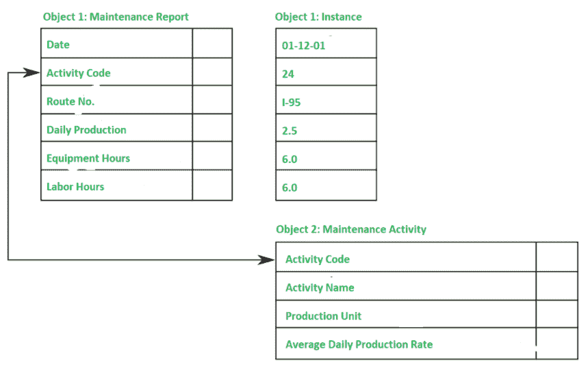
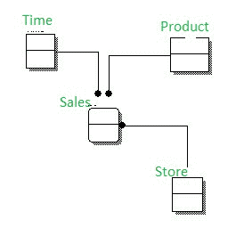

# OODM 和 CDM 的区别

> 原文:[https://www . geesforgeks . org/区别-oodm-和-cdm/](https://www.geeksforgeeks.org/difference-between-oodm-and-cdm/)

**1。面向对象数据建模(OODM) :**
在 OODM，数据和/或它们的关系都被组织或包含在一个称为对象的单一结构中。对象包括关于对象内事实之间的关系的信息，以及关于它与其他对象的关系的信息。也有人说是语义[数据模型](https://www.geeksforgeeks.org/data-models-in-dbms/)。

一个对象是现实世界实体的抽象，一个对象只代表实体的一次出现。

**OODM 特色:**

*   它支持复杂对象的表示。
*   它支持封装。
*   它显示出遗传性。
*   它支持对象同一性的概念。

**示例:**
形状、圆形、矩形和三角形。圆具有“中心”和“半径”属性。三角形有基础和高度等属性。

**2。概念数据模型(CDM) :**
它确定了不同实体之间的最高级别关系。这个模型是数据模型最抽象的形式。由于它的简单性，它有助于向广泛的利益相关者传达想法。

**清洁发展机制的特点:**

*   它包括重要的实体以及它们之间的关系。
*   未指定属性。
*   未指定主键。

**示例:**
实体关系模型，使用实体、属性、关系等主要概念。

**OODM 和 CDM 的区别:**

| OODM | 连续地层（倾角仪） |
| --- | --- |
| 代表面向对象的数据建模。 | 代表概念数据建模。 |
| 它有对象，对象包括行为。 | 它没有对象。 |
| 数据和/或它们的关系都被组织或包含在一个称为对象的单一结构中。 | 它确定了不同实体之间的最高级别关系。 |
| 它是一个对象的实例。 | 它有实体。 |
| 继承包括状态和行为。 | 它不包括状态和行为。 |
| 它有一个消息的概念。 | 清洁发展机制中没有相应的概念。 |
| 封装存在于 OODM。 | 清洁发展机制中没有这样的概念。 |
| 它有像三角形一样的属性，有“底部”和“高度”这样的属性，这是 OODM 的例子。 | 实体关系模型是清洁发展机制的例子，它使用实体、属性和关系等主要概念。 |

