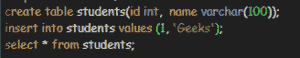
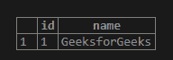

# 【PostgreSQL 和 MongoDB 的区别

> 原文:[https://www . geesforgeks . org/PostgreSQL-and-MongoDB/](https://www.geeksforgeeks.org/difference-between-postgresql-and-mongodb/)之间的差异

**1。PostgreSQL(Object-Relational Database):**
PostgreSQL 是一个强大的开源对象关系数据库管理系统(ORDBMS)，强调可扩展性和标准合规性，它使用并扩展了 SQL 语言，并结合了许多安全存储和扩展最复杂数据工作负载的功能。PostgreSQL 是符合 ACID 的、事务性的，它以表格格式存储数据，并使用约束、触发器、角色、存储过程和视图作为核心组件。

**为什么要用 PostgreSQL？**

*   免费开放源码。
*   有多种语言版本。
*   高度可扩展。
*   保护数据完整性。
*   构建容错环境。
*   健壮的访问控制系统
*   支持国际字符。
*   苹果用 PostgreSQL！

**在 PostgreSQL 中编写查询:**

*   **创造** ***学生*** **表**

```
 CREATE TABLE students (id INT, name VARCHAR (100)); 
```

*   **将记录插入** ***学生*** **表**

```
 INSERT INTO students VALUES (1, 'Geeks'); 
```

*   **读书记录来自** ***学生*** **表**

```
 SELECT * FROM students; 
```




*   **更新** ***学生*** **表**
    中的记录

```
 UPDATE students SET name="GeeksforGeeks" WHERE id = 1; 
```



*   **从** ***学生*** **表**
    中删除记录

```
 DELETE FROM students WHERE id = 1; 
```

**2。MongoDB(跨平台面向文档的数据库):**
MongoDB 是一个 NoSQL 数据库，其中每个记录都是由键值对组成的文档，键值对类似于带有模式的 JSON 对象。MongoDB 很灵活，允许其用户创建模式、数据库、表等。可由主键识别的文档构成了 MongoDB 的基本单元。一旦安装了 MongoDB，用户也可以使用 Mongo shell。Mongo shell 提供了一个 JavaScript 接口，用户可以通过这个接口进行交互和 CRUD 操作。

换句话说，我们可以说 MongoDB 是一个通用的、基于文档的分布式数据库，它是为现代应用程序开发人员和云时代而构建的，并在服务器端公共许可证下获得许可。

**为什么要用 MongoDB？**

*   可扩展，可服务多台机器。
*   它是基于 JavaScript 的，这使得它更容易使用。
*   响应速度更快，因为它是一个面向文档的数据库。
*   更简单的环境设置
*   它使用 JSON 语法，非常容易使用，并且具有广泛的浏览器兼容性。
*   无论是对象、对象成员、数组、值和字符串，数据都以 JSON 的形式存储。
*   优步和斯塔克公司使用 MongoDB！

**在 MongoDB 中编写查询:**

*   **创建** ***学生*** **数据库**

```
 use student; 
```

*   **创建** ***学生*** **表**

```
 db.createCollection("students"); 
```

*   **将记录插入** ***学生*** **集合**

```
 db.students.insert 
(
    {
        "id" : 1,
        "Name" : "Harry",
                 "Team": "Geeks For Geeks"
    }
); 
```

*   **读书从** ***学生*** **收藏**

```
 db.students.find({Name : "Harry"}).forEach(printjson); 
```

【PostgreSQL 与 MongoDB 的区别:

<figure class="table">

| MongoDB | 一种数据库系统 |
| --- | --- |
| MongoDB 是用 C++编写的 | PostgreSQL 是用 C 语言编写的 |
| MongoDB 是由 10gen 在 2007 年创立的，该公司基于*这个巨大的词*创造了这个产品 | PostgreSQL 是一个开源项目，由 PostgreSQL 全球开发小组及其多产社区维护 |
| MongoDB 提供了社区支持论坛、服务器故障和 StackOverflow。用户还可以通过企业级支持获得 24×7 的企业级支持。 | PostgreSQL 为用户提供了各种各样的社区和商业支持选项。社区支持包括邮件列表和 IRC |
| 非关系数据库管理系统 | 关系数据库管理系统 |
| 面向文档 | 面向对象的 |
| 仅提供英语版本 | 有多种语言版本 |

**哪个最好，为什么？**

**PostgreSQL 在以下情况下是最好的:**您需要开箱即用的符合标准、事务性和 ACID(原子性、一致性、隔离性和持久性)的产品，这些产品也广泛支持 NoSQL 特性。

**当:**您需要实时分析的可伸缩性和缓存，但不是为事务性数据(即会计系统)而构建时，MongoDB 是最好的。

</figure>