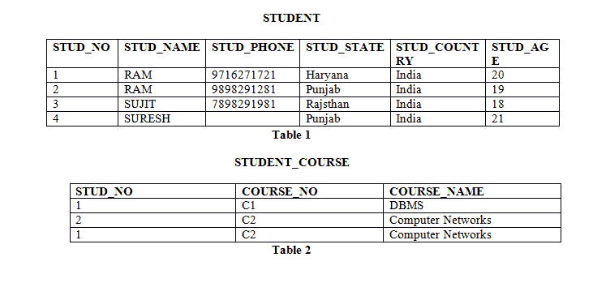

# 主键和外键的区别

> 原文:[https://www . geesforgeks . org/主键和外键的区别/](https://www.geeksforgeeks.org/difference-between-primary-key-and-foreign-key/)

**[主键](https://www.geeksforgeeks.org/types-of-keys-in-relational-model-candidate-super-primary-alternate-and-foreign/) :**
主键用于保证特定列中的数据唯一。它是一个不能有空值的列。它可以是现有的表列，也可以是数据库根据定义的顺序专门生成的列。

**示例:**参考图–
STUD_NO 和 STUD_PHONE 都是关系 STUDENT 的候选键，但是 STUD _ NO 可以选择为主键(在众多候选键中只能选择一个)。

**[外键](https://www.geeksforgeeks.org/types-of-keys-in-relational-model-candidate-super-primary-alternate-and-foreign/) :**
外键是关系数据库表中的一列或一组列，在两个表中的数据之间提供链接。它是引用另一个表的列(通常是主键)的一列(或多列)。

**示例:**参考图–
STUDENT _ COURSE 中的 STUDENT _ NO 是 STUDENT 关系中 STUDENT _ NO 的外键。

**图:**

让我们看看主键和外键之间的区别:

| 没有 | 主关键字 | 外键 |
| --- | --- | --- |
| one | 主键用于确保特定列中的数据是唯一的。 | 外键是关系数据库表中的一列或一组列，它在两个表中的数据之间提供链接。 |
| Two | 它唯一标识关系数据库表中的一条记录。 | 它引用一个表中的字段，该字段是另一个表的主键。 |
| three | 一个表中只允许有一个主键。 | 而一个表中允许有多个外键。 |
| four | 它是唯一约束和非空约束的组合。 | 它可以包含重复的值和关系数据库中的一个表。 |
| five | 它不允许空值。 | 它也可以包含空值。 |
| six | 不能从父表中删除其值。 | 它的值可以从子表中删除。 |
| seven | It 约束可以在临时表上隐式定义。 | 不能在本地或全局临时表上定义 It 约束。 |

