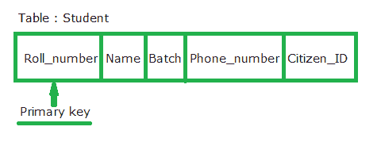
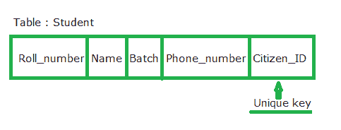

# 主键和唯一键的区别

> 原文:[https://www . geesforgeks . org/主键和唯一键的区别/](https://www.geeksforgeeks.org/difference-between-primary-key-and-unique-key/)

先决条件–[关系模型中的键](https://www.geeksforgeeks.org/dbms-keys-candidate-super-primary-alternate-and-foreign/)
**主键**是唯一标识该表中每个元组(行)的表列。主键对表强制实施完整性约束。一个表中只允许使用一个主键。主键不接受任何重复值和空值。表中的主键值很少发生变化，因此在很少发生变化的地方要小心选择。一个表的主键可以被另一个表的外键引用。

为了更好地理解主键，我们采用名为学生表的表，该表具有诸如辊号、姓名、批次、电话号码、公民身份等属性。

“学号”属性永远不能有相同的空值，因为在大学注册的每个学生都可以有唯一的学号，因此两个学生不能有相同的学号，并且表中的每一行都由学生的学号唯一标识。因此，在这种情况下，我们可以将 Roll_number 属性作为主键。

**唯一键**约束还唯一标识关系或表中的单个元组。与主键不同，表可以有多个唯一键。唯一键约束只能接受列的一个空值。唯一约束也被另一个表的外键引用。当有人想要对一列和一组非主键的列实施唯一约束时，可以使用它。

为了更好地理解唯一键，我们采用了带有滚动号、姓名、批次、电话号码和公民身份属性的学生表。

号码属性已经分配了主键，并且公民标识可以有唯一的约束，其中公民标识列中的每个条目都应该是唯一的，因为一个国家的每个公民都必须有他或她的唯一标识号，如阿拉伯数字。但是，如果学生在这种情况下迁移到另一个国家，他或她将没有任何公民标识，并且条目可能具有空值，因为在唯一约束中只允许一个空值。

**主键和唯一键的关键区别:**

主键不接受空值，而唯一键可以接受空值。

1.  一个表只能有一个主键，而一个表上可以有多个唯一键。
2.  定义主键时自动创建的聚集索引，而唯一键生成非聚集索引。

**对比图:**

<figure class="table">

| 参数 | 主关键字 | 唯一密钥 |
| --- | --- | --- |
| 基础 | 用于作为表中每行的唯一标识符。 | 唯一确定不是主键的行。 |
| 空值接受 | 不能接受空值。 | 可以接受空值。 |
| 表中可以定义的键的数量 | 只有一个主键 | 多个唯一键 |
| 索引 | 创建聚集索引 | 创建非聚集索引 |

</figure>