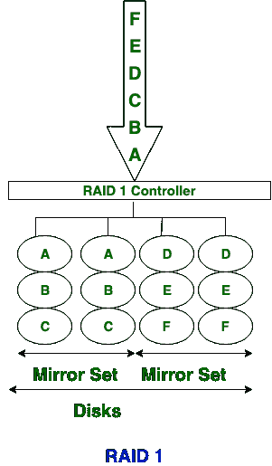
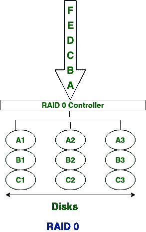

# 【RAID 0 和 RAID 1 的区别

> 原文:[https://www . geeksforgeeks . org/raid-0 和 raid-1 的区别/](https://www.geeksforgeeks.org/difference-between-raid-0-and-raid-1/)

**RAID** 代表**独立磁盘冗余阵列**，是用于磁盘组织的技术，以提高可靠性和性能。 **RAID 0** 代表**独立磁盘冗余阵列 0 级**和 **RAID 1** 代表**独立磁盘冗余阵列 1 级**都是 RAID 的类别。RAID 0 和 RAID 1 的主要区别在于，在 RAID 0 技术中，使用了磁盘剥离。另一方面，在 RAID 1 技术中，使用磁盘镜像。

| S.NO | RAID 0 | RAID 1 |
| 1. | RAID 0 代表独立磁盘冗余阵列 0 级。 | 而 RAID 1 代表独立磁盘冗余阵列 1 级。 |
| 2. | 在 RAID 0 技术中，使用磁盘剥离。 | 而在 RAID 1 技术中，使用磁盘镜像。 |
| 3. | RAID 0 技术成本低。 | 而 RAID 1 成本很高或很贵。 |
| 4. | 在 RAID 0 中，没有写入损失。 | 而在 RAID 1 中，存在写入损失。 |
| 5. | RAID 0 的相对存储效率为 100%。 | 而 RAID 1 的相对存储效率为 50%。 |
| 6. | RAID 0 的写入性能优于 RAID 1。 | 而 RAID 1 的写入性能比 RAID 0 慢。 |
| 7. | RAID 0 强调数据访问速度。 | 而在 RAID 1 中，则强调数据可用性。 |
| 8. | RAID 0 的读取性能很好。 | 而 RAID 1 的读取性能中等。 |
| 9. | 在 RAID 0 中，没有可用的保护。 | 在 RAID 1 中，提供镜像保护。 |