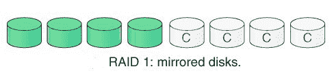
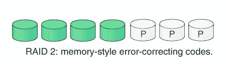

# 【RAID 1 和 RAID 2 的区别

> 原文:[https://www . geeksforgeeks . org/raid-1 和 raid-2 的区别/](https://www.geeksforgeeks.org/difference-between-raid-1-and-raid-2/)

**1。RAID 1:**
RAID 1 也称为数据镜像。因为它将数据从驱动器 1 复制到驱动器 2。驱动器的一半用于存储数据，另一半用作已存储数据的镜像。该级别在出现故障时提供 100%冗余。

**优势–**
良好的容错能力，即..即使一个磁盘出现故障也能保持功能的能力。

**劣势–**
价格昂贵，因为镜像需要额外的驱动器。

**2。RAID 2:**
RAID 2 由位级条带化组成。它使用汉明码奇偶校验记录纠错码。在这个级别中，一个字中的每个数据位被记录在单独的磁盘上，并且数据字的纠错码被存储在不同的磁盘组上。

**优势–**
在纠错的情况下使用汉明码。

**劣势–**
由于额外驱动，结构复杂，成本高。

**RAID 1 和 RAID 2 的区别:**

| 不，先生。 | RAID 1 | RAID 2 |
| --- | --- | --- |
| 1. | RAID 1 代表独立磁盘冗余阵列 1 级。 | RAID 2 代表独立磁盘冗余阵列 2 级。 |
| 2. | 在 RAID 1 技术中，使用磁盘镜像。 | 在 RAID 2 技术中，使用了位级条带化。 |
| 3. | 在 RAID 1 中，一半驱动器用于存储数据，另一半只是已存储数据的镜像 | 在 RAID 2 中，一个字中的每个数据位都记录在一个单独的磁盘上，ECC 代码存储在不同的磁盘上 |
| 4. | 与 RAID 2 相比具有良好的容错能力。 | 容错性不太好。 |
| 5. | 没有使用汉明码。 | 汉明码用于纠错。 |
| 6. | 镜像需要额外的驱动器。 | 纠错需要额外的驱动器。 |

