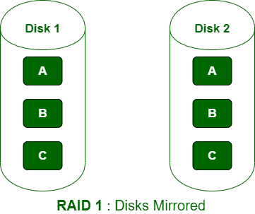

# 【RAID 1 和 RAID 5 的区别

> 原文:[https://www . geeksforgeeks . org/raid-1 和 raid-5 的区别/](https://www.geeksforgeeks.org/difference-between-raid-1-and-raid-5/)

**先决条件–**[RAID](https://www.geeksforgeeks.org/raid-full-form/?ref=rp)、 [RAID 等级](https://www.geeksforgeeks.org/raid-redundant-arrays-of-independent-disks/?ref=rp)
**1。RAID 1 :**
RAID 1 也称为数据镜像配置，因为它将数据从驱动器 1 复制到驱动器 2。在 RAID 1 中，其中一个驱动器用于存储数据，另一个驱动器作为已存储数据的镜像。这种级别的 RAID 在出现故障时提供 100%的数据冗余。

**优势–**
它具有良好的容错能力，即即使一个磁盘出现故障也能保持功能。

**劣势–**
价格昂贵，因为镜像需要额外的驱动器。

**2。RAID 5 :**
在 RAID 5 中，数据平均分配在所有磁盘中，所需的最小物理磁盘数为 3。与 RAID 1 相比，RAID 5 的主要优点是不需要大空间，支持恢复时的数据访问，数据安全性高。RAID 5 通常适用于中等级别的应用程序。

**优势–**
引入 RAID 5，使随机写入性能更好。

**劣势–**
RAID 5 最多允许恢复 1 个磁盘故障(因为奇偶校验的工作方式)。如果多个磁盘出现故障，则无法恢复数据。

**RAID 1 和 RAID 5 的区别:**

| 没有。 | RAID 1 | RAID 5 |
| --- | --- | --- |
| 1. | RAID 1 代表独立磁盘冗余阵列 1 级。 | RAID 5 代表独立磁盘冗余阵列 5 级。 |
| 2. | 在 RAID 1 中，数据不会在磁盘中分割。 | 在 RAID 5 中，数据在所有磁盘中平均分配。 |
| 3. | RAID 1 的写入速度比 RAID 5 慢。 | RAID 5 的写入速度优于 RAID 1。 |
| 4. | 在 RAID 1 中，最少需要 2 个物理磁盘。 | 在 RAID 5 中，最少需要 3 个物理磁盘。 |
| 5. | RAID 1 支持镜像和冗余。 | RAID 5 不支持镜像和冗余。 |
| 6. | RAID 1 中的数据访问速率较低。 | RAID 5 的数据访问率很高。 |
| 7. | 在 RAID 1 中，镜像间距需要很大的空间。 | 在 RAID 5 中，不需要大空间。 |
| 8. | 在 RAID 1 中，我们无法在恢复时访问数据。 | 在 RAID 5 中，可以在从故障中恢复数据的同时访问数据。 |
| 9. | RAID 1 中的数据安全性较低。 | RAID 5 中的数据安全性非常高。 |
| 10. | RAID 1 最适合高端应用。 | RAID 5 通常适用于中等级别的应用程序。 |

