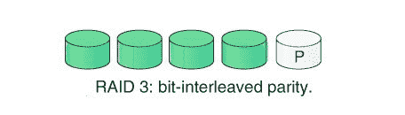
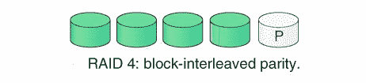

# 【RAID 3 和 RAID 4 的区别

> 原文:[https://www . geeksforgeeks . org/raid-3 和 raid-4 的区别/](https://www.geeksforgeeks.org/difference-between-raid-3-and-raid-4/)

**1。RAID 3:**
RAID 3 由字节级条带化组成。它将数据条带化到多个磁盘上。为每个磁盘部分生成并存储在不同专用磁盘上的奇偶校验位。这个级别克服了单个磁盘故障。

**优势–**

1.  数据可以批量传输
2.  数据可以并行访问。

**缺点–**

1.  它需要额外驱动器来实现奇偶校验。
2.  在小文件的情况下，它执行缓慢。

**2。RAID 4:**
RAID 4 由块级条带化组成。在这个级别中，整个数据集或数据块被写入数据磁盘，然后奇偶校验被生成并存储在不同的磁盘集上。这个级别最多克服一个磁盘故障。如果发生多个磁盘故障，则无法恢复数据。RAID 3 和 RAID 4 都需要至少三个磁盘来实现 RAID。

**优势–**

1.  由于数据块条带化，它便于同时进行输入/输出请求。
2.  存储开销很低。

**缺点–**

1.  奇偶校验磁盘可能会导致瓶颈。
2.  由于单独的块奇偶校验，随机写入速度较慢。

【RAID 3 和 RAID 4 的区别:

| 不，先生。 | RAID 3 | RAID 4 |
| --- | --- | --- |
| 1. | RAID 3 代表独立磁盘冗余阵列 3 级。 | RAID 4 代表独立磁盘冗余阵列 4 级。 |
| 2. | 在 RAID 3 技术中，使用字节级条带化。 | 在 RAID 4 技术中，使用块级条带化。 |
| 3. | 在此级别中，为每个磁盘部分生成奇偶校验位，并存储在不同的磁盘上。 | 在这一级，为整个数据块生成奇偶校验位，并存储在不同的磁盘上 |
| 4. | 随机读取的性能最差。 | 良好的随机读取，因为数据块是条带化的。 |
| 5. | 在大文件的情况下，性能很好。 | 性能较低，因为一次只能访问一个数据块 |

