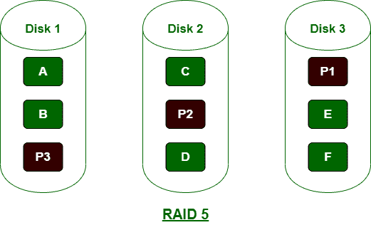
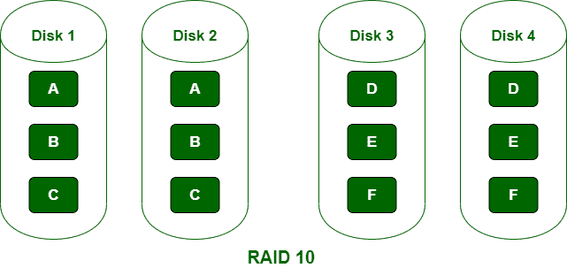

# 【RAID 5 和 RAID 10 的区别

> 原文:[https://www . geeksforgeeks . org/raid-5 和 raid-10 的区别/](https://www.geeksforgeeks.org/difference-between-raid-5-and-raid-10/)

**1。RAID 5 :**
在 RAID 5 中，数据平均分配在所有磁盘中，所需的最小物理磁盘数为 3。RAID 5 的主要优点是不需要镜像空间，支持恢复时的数据访问，数据安全性高。RAID 5 通常适用于中等级别的应用程序。

**2。**
RAID 10 也被称为镜像条带。它是一个嵌套的 RAID 级别，因为它结合了两个标准 RAID 级别的功能:RAID 0 和 RAID 1。RAID 10 同时支持镜像和条带化功能，可靠性非常好。这是昂贵的，因为使用了更多数量的磁盘，所需的最小物理磁盘数量是 4。

**RAID 5 和 RAID 10 的区别:**

| 没有。 | RAID 5 | RAID 10 |
| --- | --- | --- |
| 1. | 在 RAID 5 中，数据在所有磁盘中平均分配。 | 在 RAID 10 中，为了数据安全，数据存储在一个磁盘中，并镜像到另一个磁盘中。 |
| 2. | 它强调数据存储。 | 而 RAID 10 强调性能而不是存储。 |
| 3. | 它不如 RAID 10 可靠。 | 它在可靠性上远远好于 RAID 5。 |
| 4. | 在 RAID 5 中，最少需要 3 个物理磁盘。 | 在 RAID 10 中，最少需要 4 个物理磁盘。 |
| 5. | 与 RAID 10 相比，RAID 5 的写入速度更快。 | 与 RAID 5 相比，RAID 10 的写入速度较慢。 |
| 6. | 与 RAID 10 相比，它有更多的存储空间。 | 与 RAID 5 相比，它的存储空间更少。 |
| 7. | 它不支持数据的镜像和冗余。 | 它支持数据的镜像和冗余。 |
| 8. | 它更复杂，因为有驱动器和奇偶校验磁盘。 | 由于没有奇偶校验磁盘，它比 RAID 5 简单。 |
| 9. | 这是值得的，因为它包含较少数量的磁盘。 | 它很贵，因为它包含更多数量的磁盘。 |

