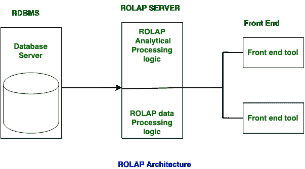
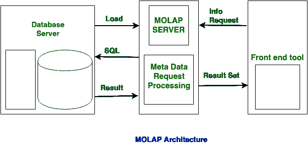

# 【ROLAP 和 MOLAP 的区别

> 原文:[https://www . geesforgeks . org/rolap 和-molap 之间的差异/](https://www.geeksforgeeks.org/difference-between-rolap-and-molap/)

**关系在线分析处理(ROLAP):**
ROLAP 用于大数据量，在这种情况下，数据存储在关系表中。在 ROLAP 中，创建数据的静态多维视图。

**多维在线分析处理(MOLAP):**
MOLAP 用于有限的数据量，在这种情况下，数据存储在多维数组中。在 MOLAP 中，创建数据的动态多维视图。

ROLAP 和 MOLAP 的主要区别在于，在 ROLAP 中，数据是从数据仓库中获取的。另一方面，在 MOLAP 中，数据是从 MDDBs 数据库中获取的。这两者之间的通称是 **OLAP** 。

让我们看看 ROLAP 和 MOLAP 的区别:

| S.NO | 罗尔普 | 莫普 |
| 1. | ROLAP 代表**关系在线分析处理。** | 而 MOLAP 代表**多维在线分析处理。** |
| 2. | ROLAP 用于大数据量。 | 而它用于有限的数据量。 |
| 3. | ROLAP 的访问速度很慢。 | 而 MOLAP 的访问速度很快。 |
| 4. | 在 ROLAP 中，数据存储在关系表中。 | 而在 MOLAP 中，数据存储在多维数组中。 |
| 5. | 在 ROLAP 中，数据是从数据仓库中获取的。 | 在 MOLAP 中，数据是从 MDDBs 数据库中获取的。 |
| 6. | 在 ROLAP 中，使用复杂的 sql 查询。 | 而在 MOLAP 中，使用稀疏矩阵。 |
| 7. | 在 ROLAP 中，创建数据的静态多维视图。 | 而在 MOLAP 中，数据的动态多维视图被创建。 |

