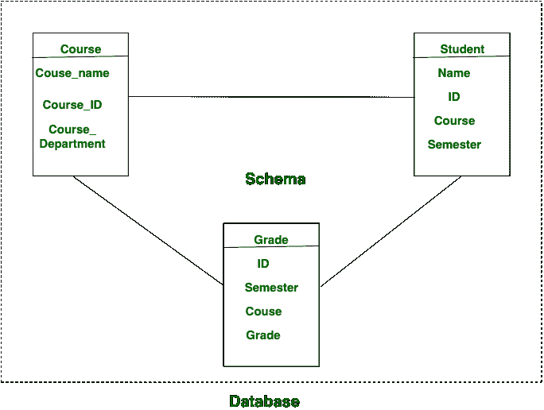

# 模式和数据库的区别

> 原文:[https://www . geesforgeks . org/schema-and-database 的区别/](https://www.geeksforgeeks.org/difference-between-schema-and-database/)

**数据库:**
数据库可能是当今生活中的常用名词。几家企业、公司、组织、研究所等。需要一个系统以一种非常好的格式存储他们的信息，以便可以很容易地从中检索出有用的数据。而策划信息。

**模式:**
模式是这样的，它描述了信息的结构读取，确认了在制作信息时将涉及的表、表的属性及其关联。

让我们看看模式和数据库之间的区别:

| S.NO | (计划或理论的)纲要 | 数据库ˌ资料库 |
| 1. | 模式可以是信息或数据库的结构化读取。 | 信息或数据库可以是网状知识的分类。 |
| 2. | 模式一旦声明就不能经常更改。 | 信息或数据库中的知识一直在变化，因此数据库或信息经常被修改。 |
| 3. | 在模式中，包含了表名、字段名、排序和约束。 | 数据库或信息包括这样的模式、记录、信息约束。 |
| 4. | 对于信息，模式是由 DDL 指定的。 | 在数据库中，更新和添加等操作是使用 DML 完成的。 |