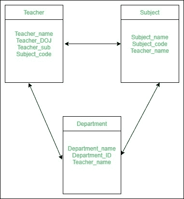

# 数据库管理系统中模式和实例的区别

> 原文:[https://www . geesforgeks . org/DBMS 中模式和实例的区别/](https://www.geeksforgeeks.org/difference-between-schema-and-instance-in-dbms/)

**1。实例:**
实例是在特定时刻存储的信息的集合。实例可以通过某些 CRUD 操作进行更改，如添加、删除数据。可以注意到，任何搜索查询都不会在实例中进行任何种类的改变。

**示例–**
假设我们的数据库中有一个名为 School 的表老师，假设该表有 50 条记录，那么数据库的实例现在有 50 条记录，明天我们将再添加 50 条记录，那么明天该实例总共有 100 条记录。这称为实例。

**2。模式:**
模式是对数据库的整体描述。数据如何存储在数据库中的基本结构称为模式。



模式有三种类型:逻辑模式、物理模式和视图模式。

1.  **逻辑模式–**描述在逻辑层面设计的数据库。
2.  **物理模式–**描述在物理层面设计的数据库。
3.  **视图模式**–它在视图级别定义了数据库的设计。

**示例–**
假设我们的数据库中有一个名为 school 的老师表，这个老师表要求他们的表中有 name、dob、doj，所以我们设计了一个结构如下:

```
Teacher table
name: String
doj: date
dob: date 
```

上面给出的是表格老师的模式。

**模式和实例的区别:**

<figure class="table">

| (计划或理论的)纲要 | 情况 |
| --- | --- |
| 它是数据库的总体描述。 | 它是在特定时刻存储在数据库中的信息的集合。 |
| 整个数据库的架构相同。 | 实例中的数据可以通过添加、删除和更新来更改。 |
| 不会经常更改。 | 经常变化。 |
| 定义数据库的基本结构，即数据将如何存储在数据库中。 | 它是在特定时间存储的一组信息。 |

</figure>