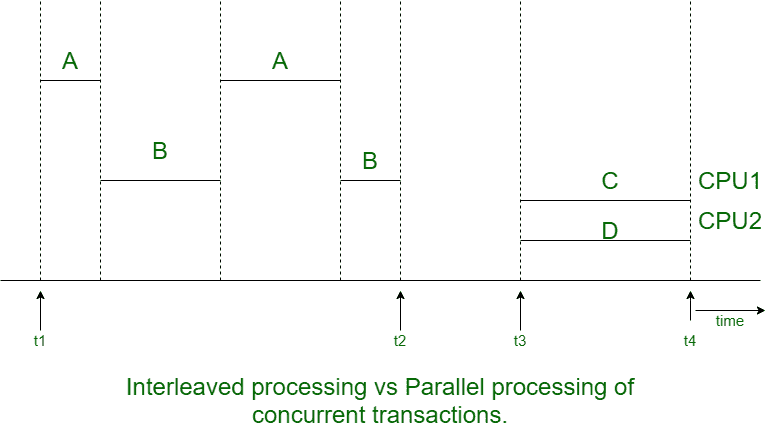

# 单用户和多用户数据库系统的区别

> 原文:[https://www . geesforgeks . org/单用户和多用户数据库系统之间的区别/](https://www.geeksforgeeks.org/difference-between-single-user-and-multi-user-database-systems/)

对数据库系统进行分类的标准是根据可以同时使用该系统的用户数量。它可以分为单用户和多用户数据库系统。

**1。单用户数据库系统:**
在这些数据库管理系统中，一次只有一个用户可以访问数据库。因此，用户可以随时使用所有资源。所有这些系统都用于个人用途，如个人电脑体验。在这种类型的数据库管理系统中，用户可以使用物理层和应用层。

**示例–**
个人电脑

**2。多用户数据库系统:**
这些数据库管理系统支持两个或两个以上的用户同时访问数据库。多用户系统包含所有的微型计算机和大型计算机。在大型计算机中，数据库可能存在于单台计算机上，而在其他计算机中，数据库可能分布在多台计算机上。多个用户可以在同时工作的同时更新数据。

**示例–**
银行、保险机构、证券交易所、超市等的数据库。

**单用户和多用户数据库系统的区别:**

| 单用户数据库系统 | 多用户数据库系统 |
| --- | --- |
| 如果一次最多有一个用户可以使用系统，那么数据库管理系统就是单用户的。 | 如果多个用户可以同时使用系统并访问数据库，那么数据库管理系统就是多用户的。 |
| 单用户数据库管理系统大多局限于个人计算机系统。 | 大多数数据库管理系统是多用户的，如航空预订系统数据库、银行数据库等。 |
| 单用户数据库没有多道程序设计，因此，单个中央处理器一次最多只能执行一个进程。 | 由于多道程序设计的概念，多个用户可以同时访问数据库和使用计算机系统。 |
| 例如:个人电脑。 | 例如:银行、保险机构、证券交易所、超市等的数据库。 |

单个中央处理器一次最多只能执行一个进程。然而，多编程操作系统执行来自一个进程的一些命令，然后挂起该进程并执行来自下一个进程的一些命令，等等。每当轮到某个进程再次使用中央处理器时，该进程就会从暂停的位置恢复。

因此，流程的并发执行实际上是交错的，如下图所示–

上图显示了两个进程，A 和 B，以交错方式并发执行。

当进程需要输入或输出(I/O)操作时，如从磁盘读取数据块，交错会使 CPU 保持忙碌状态。CPU 被切换到执行另一个进程，而不是在输入/输出期间保持空闲

交错还可以防止长进程延迟其他进程。如果计算机系统有多个硬件处理器(CPU)，多个进程的并行处理是可能的，如上图中的进程 C 和 D 所示。